# RC-Box Design Specification Diagrams

Companion diagrams for DESIGN_SPECS.md. Render Mermaid diagrams using a compatible viewer (GitHub, VS Code with Mermaid extension, mermaid.live, etc.)

---

## System Architecture Overview

High-level view of all RC-Box components and their relationships.

```mermaid
flowchart TB
    subgraph External["External Systems"]
        SUN["☀️ Solar Panel<br/>50-200W"]
        CLOUD["☁️ Cloud/ORC Server"]
        SENSOR["📊 Commercial Sensors<br/>(Modbus RTU)"]
    end

    subgraph Power["Power System"]
        MPPT["MPPT Charge<br/>Controller"]
        BATT["LiFePO4 Battery<br/>20-100Ah"]
        FUSE1["20A Fuse"]
        TB12V["12V Terminal<br/>Block"]
        DCDC["DC-DC Buck<br/>Converter"]
        FUSE2["5A Polyfuse"]
    end

    subgraph Compute["Compute System"]
        WITTY["Witty Pi 4<br/>(RTC/Power Mgmt)"]
        PI["Raspberry Pi 5"]
        SSD["512GB+ SSD"]
        MODEM["4G Cellular<br/>Modem"]
    end

    subgraph Cameras["Camera System"]
        CAM1["📷 Camera 1<br/>IP67/IP68 Sealed"]
        CAM2["📷 Camera 2<br/>IP67/IP68 Sealed"]
    end

    subgraph IRSystem["IR Spotlight System"]
        USBRELAY["5V USB Relay"]
        PHOTORELAY["Photoresistor<br/>Relay Module"]
        IR["💡 IR Spotlight<br/>20-30W 850nm"]
    end

    subgraph Sensors["Sensor Interface"]
        RS485["USB-RS485<br/>Adapter"]
        TERMBLK["Terminal Block<br/>A+ B- GND 12V"]
    end

    subgraph Security["Anti-Theft System"]
        TAMPER["Tamper Switch<br/>(N.C.)"]
        VIBRATION["Vibration Sensor"]
        ALARM["Alarm Controller"]
        SIREN["🔊 120dB Siren"]
    end

    %% Power flow
    SUN --> MPPT
    MPPT --> BATT
    BATT --> FUSE1
    FUSE1 --> TB12V
    TB12V --> DCDC
    DCDC --> FUSE2
    FUSE2 --> WITTY
    WITTY --> PI

    %% Compute connections
    PI --> SSD
    PI --> MODEM
    MODEM --> CLOUD

    %% Camera connections
    PI -->|USB| CAM1
    PI -->|USB| CAM2

    %% IR system
    PI -->|USB 5V| USBRELAY
    TB12V --> PHOTORELAY
    USBRELAY -->|Enable| PHOTORELAY
    PHOTORELAY --> IR

    %% Sensor interface
    PI -->|USB| RS485
    RS485 --> TERMBLK
    TB12V -->|12V| TERMBLK
    TERMBLK --> SENSOR

    %% Security
    TB12V --> ALARM
    TAMPER --> ALARM
    VIBRATION --> ALARM
    ALARM --> SIREN
```

---

## Power System Detail

Detailed view of power flow from solar panel to all loads.

---

## IR Spotlight Control Logic

Two-stage control using commodity relay modules.

---

## Configuration A: Two-Box System

Physical layout showing separate compute and power enclosures.

---

## Configuration B: Combined Single-Box System

All components in one enclosure.

---

## Sensor Integration

Connection of commercial Modbus sensors.

---

## Anti-Theft System

Security sensor chain with fail-secure design.

---

## Data Flow

How data moves through the system.

---

## Enclosure Sealing Detail

Cable gland and environmental protection.

---

## Deployment Topology

Typical installation showing physical arrangement.

