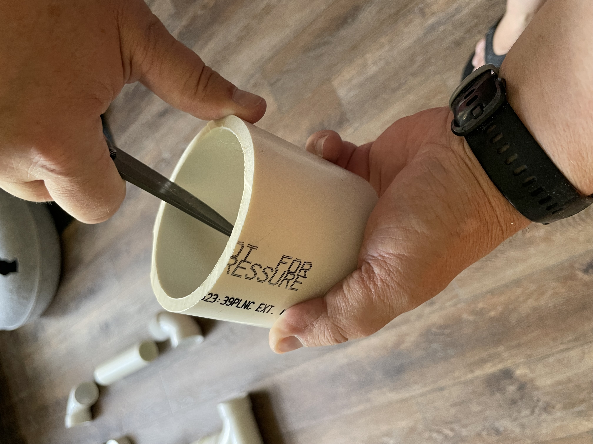

# PVC Bathymetry Shuttle Build Instructions

This guide provides step-by-step instructions for building a PVC bathymetry shuttle used for water depth measurements in rivers and streams.

## 1. Background

The PVC bathymetry shuttle is a simple, cost-effective device designed to measure water depth profiles across river cross-sections by using a highly accurate [RTK GPS](https://www.ardusimple.com/rtk-explained/) along with an inexpensive depth finder to record the depth of a body of water at a specific location. When combined with an arduino device to log both values, the bathymetry shuttle can map the underside of a body of water with a high degree of accuracy. [OpenRiverCam](https://github.com/localdevices/ORC-OS) uses this data along with video analysis of the surface movement to calculate the flow of a river using inexpensive commodity hardware. This provides an alternative to the cost, labor and civil construction required for more traditional measurements (staff gauges, float systems, pressure loggers, etc).

This project was based on [prior work](https://docs.google.com/presentation/d/1-20GT_kJZRlo2iy9VqDYBEpLsxQkqFnX/edit?slide=id.p1#slide=id.p1) by Oliver Hoes at TU Delft.

## 2. Parts List

Please note that photos are based on US/Imperial plumbing sizes which resulted in a slightly larger unit than the one described by the above slide deck.

Parts list (metric):

- PVC-glue, primer sandpaper
- Hand miter saw or power saw with panel / finish blade
- 1 x 70 mm T-piece
- 1 x 70 mm to 110 mm reducing piece 
- 1 x 110 mm socket
- 1 x 110 mm lid
- 1 meter 70 mm pipe
- 0.25 meter 110 mm pipe
- Safety equipment (eye protection, gloves)

## 3. Prepare the Parts

### 3a. Measure

The above parts should provide a shuttle that is 30cm wide by 45cm long by 30 cm high. You may alter the size of the shuttle to fit your needs and available parts, but it is *very important* to ensure that the GPS receiver is raised above the water and shielded from below. GNSS signals of the type used by RTK GPS units are reflected by water, so we do not want reflected signals to interfere with our observations. 

### 3b. Cut

Using a manual or powered miter saw equipped with a finish blade, cut all PVC components to the marked lengths. Make clean, straight cuts perpendicular to the pipe axis. A finish blade will provide smoother cuts with less chipping. Take your time and work carefully.

### 3c. Deburr

After cutting, carefully deburr both the inside and outside edges of all cut PVC pieces. Use a deburring tool, fine sandpaper, or a utility knife to remove any rough edges, burrs, or plastic shavings. Smooth edges are essential for proper fitting and will prevent damage to seals or other components during assembly.

## 4. Arrange Parts

Lay out all prepared components in the order they will be assembled. This step helps verify that all parts are present and properly prepared before beginning the permanent assembly process. Organize components logically to streamline the assembly workflow and reduce the chance of errors.

## 5. Dry-Fit Parts

Perform a complete dry-fit assembly without primer or cement to ensure all components fit properly together. Check for proper alignment, smooth joints, and overall assembly integrity. This is your opportunity to identify and correct any fitting issues before permanent assembly. Mark the orientation of parts if needed to ensure proper reassembly during the final cementing process.

## 6. Prime and Cement Parts

### 6a. Prime

Apply PVC primer to both the male and female portions of each joint to be cemented. The primer cleans and softens the PVC surface, ensuring a strong chemical bond. Work quickly but carefully, as primer begins working immediately upon application. Ensure complete coverage of all surfaces that will be joined.

### 6b. Cement

Immediately after priming, apply PVC cement to both surfaces of the joint. Work quickly as the cement sets rapidly. Apply a thin, even coat to ensure proper bonding without excess that could interfere with the joint fit. The cement chemically welds the PVC pieces together, creating a permanent, watertight seal.

### 6c. Assemble

Quickly join the cemented pieces together with a slight twisting motion to ensure even distribution of the cement. Hold the joint firmly in place for 15-30 seconds to allow initial setting. Work systematically through all joints, ensuring proper alignment before the cement fully cures. Once assembled, allow adequate curing time as specified by the cement manufacturer before handling or testing.

## 7. Finish as Desired

After the cement has fully cured, inspect all joints for completeness and integrity. Sand any rough spots smooth and clean the shuttle thoroughly. The shuttle can be painted or left as-is depending on your preferences and application requirements. Ensure all surfaces are smooth to minimize drag during deployment.

## 8. Instrument Package Preparation

to be added...