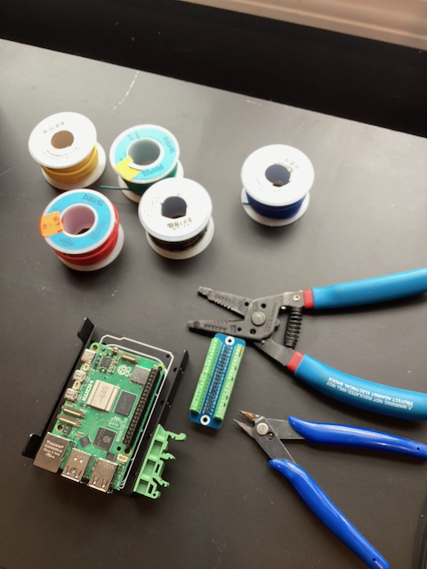
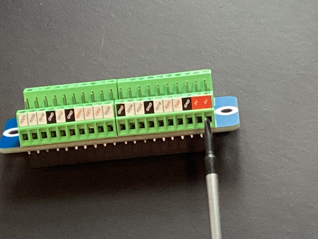
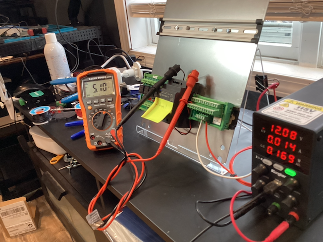
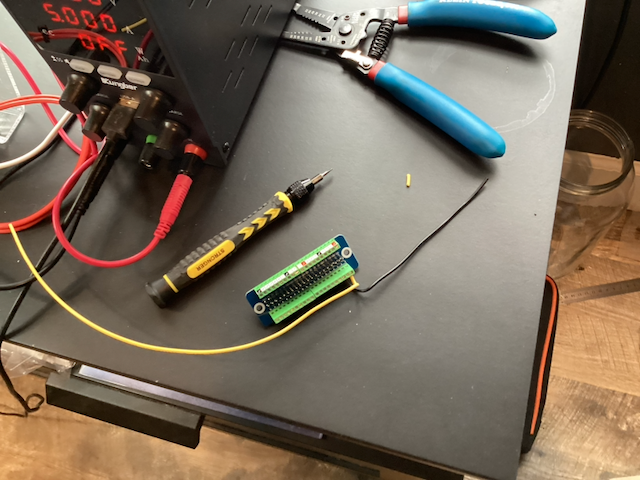
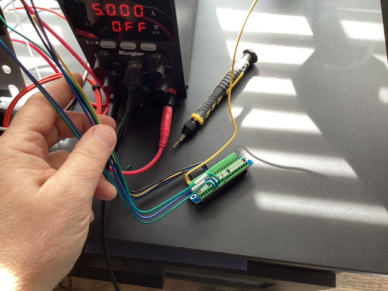
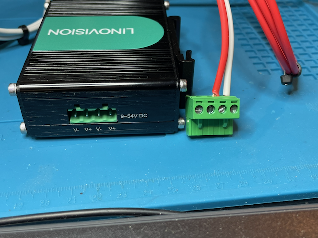
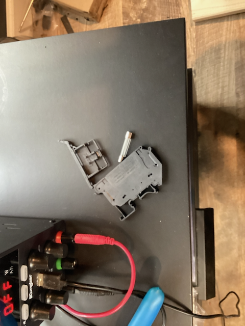
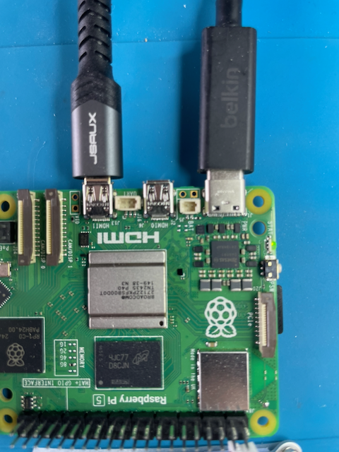
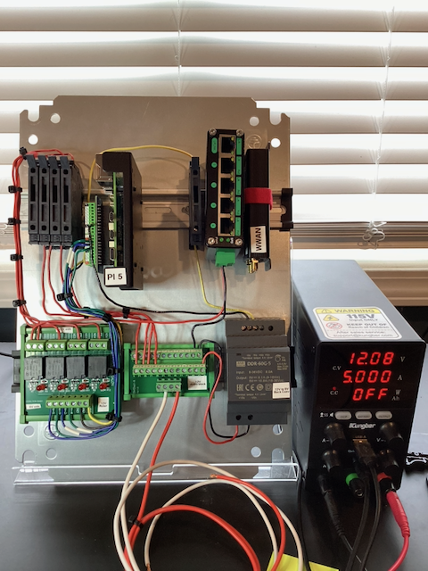
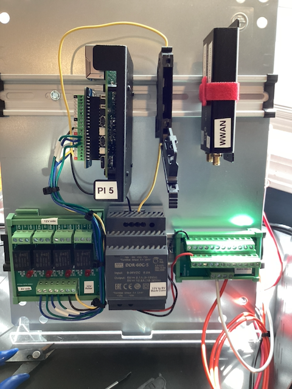

# GPIO Wiring Guide — Sukabumi ORC Station

**Rev C — 2026-03-20**
**Hardware:** Raspberry Pi 5 → Stacking Headers → Geekworm G469 Breakout

---

## Table of Contents

- [Parts Referenced in This Guide](#parts-referenced-in-this-guide)
- [Safety Rules](#safety-rules)
- [Tools Needed](#tools-needed)
- [Understanding the Relay Module](#understanding-the-relay-module)
  - [Why NO and Not NC (Fail-Safe Design)](#why-no-and-not-nc-fail-safe-design)
- [Pi 5 40-Pin Header — Pin Map](#pi-5-40-pin-header--pin-map)
- [Step-by-Step Wiring Instructions](#step-by-step-wiring-instructions)
  - [Step 1: Wire 5V Power Input to Pi](#step-1-wire-5v-power-input-to-pi-ddr-60g-5-buck-converter)
  - [Step 2: Wire the Relay Module Input Side](#step-2-wire-the-relay-module-input-side-low-voltage)
  - [Step 3: Wire the Relay Module Output Side — CH1 (PoE Switch)](#step-3-wire-the-relay-module-output-side--ch1-poe-switch)
  - [Step 4: Wire the Relay Module Output Side — CH2/3/4 (LEDs)](#step-4-wire-the-relay-module-output-side--ch234-status-leds)
  - [Step 5: Wire the Maintenance Pushbutton](#step-5-wire-the-maintenance-pushbutton)
  - [Step 6: Wire the External Power Button](#step-6-wire-the-external-power-button-pi-5-j2-header)
  - [Step 7: Wire the Hydreon RG-15 Rain Gauge](#step-7-wire-the-hydreon-rg-15-rain-gauge-uart)
  - [Step 8: Wire the SHT40 Sensor](#step-8-wire-the-sht40-temperaturehumidity-sensor-i2c)
  - [Step 9: Install RTC Battery](#step-9-install-rtc-battery-ml-2020)
- [Final Pre-Power Verification](#final-pre-power-verification)
- [First Power-On Procedure](#first-power-on-procedure)
- [Channel Summary](#channel-summary)
- [Pin Assignment Summary](#pin-assignment-summary)
- [Notes](#notes)

---

## Parts Referenced in This Guide

This guide uses specific part numbers from the Sukabumi build. If you are
building with equivalent parts, use this table to map the references to your
components.

| Reference | What It Is | Our Part | Equivalent |
|-----------|-----------|----------|------------|
| **G469** | GPIO terminal block breakout — a passive board that sits on top of the Pi's 40-pin header and exposes every pin as a labeled screw terminal | Geekworm G469 | Adafruit Pi-EzConnect (ID 2711), or any 40-pin GPIO screw terminal breakout for Raspberry Pi |
| **TB1** | 12V distribution terminal block — a DIN rail mounted terminal block that receives 12V input and distributes it to multiple outputs | Generic DIN rail terminal block | Any DIN rail screw terminal block rated for your current/voltage |
| **DDR-60G-5** | 5V buck converter — a DIN rail DC-DC converter that steps 12V down to 5V to power the Pi | Mean Well DDR-60G-5 | Any isolated DC-DC converter with 9-36V input and adjustable 5V output, DIN rail mount preferred |
| **DDR-60G-12** | 12V regulator — a DIN rail DC-DC converter that provides clean regulated 12V for the PoE switch | Mean Well DDR-60G-12 | Any isolated DC-DC converter with 9-36V input and 12V output |
| **Relay module** | 4-channel SPDT relay module with DIN rail mount, Darlington transistor drivers, and screw terminals on both input and output sides | Electronics-Salon 4-SPDT 10A | Any 4-channel relay module that accepts 3.3V trigger signals and has 5V coils with built-in drivers. Verify your module's terminal layout matches the diagrams before wiring |
| **J2 header** | Pi 5 power button header — a 2-pin header on the Raspberry Pi 5 board (near the USB-C port) used for external power button | Built into Raspberry Pi 5 | Pi 5 only — earlier Pi models do not have this header |

Pin numbers (Pin 2, Pin 6, etc.) refer to the **Raspberry Pi 40-pin GPIO header
physical pin numbering**, which is the same across all Pi models and all GPIO
breakout boards.

---

## Safety Rules

Read this section completely before touching any wire.

### Rule 1: Always Wire With Power OFF

**Disconnect the 12V battery and USB-C cable before wiring anything.**
The Pi, relay module, LEDs, and PoE switch must all be completely unpowered while
you connect or disconnect wires. Wiring while powered risks short circuits that can
instantly destroy components.

**How to verify power is off:**
- No lights on the Pi (no red LED, no green LED)
- No lights on the relay module
- No lights on the PoE switch

### Rule 2: 12V Can Damage the Pi Instantly

The Raspberry Pi GPIO pins operate at **3.3V**. If 12V touches any GPIO pin, the Pi
is destroyed immediately and cannot be repaired.

**The two voltage domains in this system:**

| Domain | Voltage | Where It Goes | Wire Gauge |
|--------|---------|---------------|------------|
| Pi power input | 5V DC | DDR-60G-5 output → G469 Pin 2/Pin 25 | 18 AWG |
| Logic (low voltage) | 3.3V / 5V | G469 breakout → relay module inputs | 22 AWG |
| Power (high voltage) | 12V DC | TB1 → relay module outputs → loads | 18-22 AWG |

**TB1** is the 12V distribution terminal block on the DIN rail. It receives 12V
from the solar battery (via the fused input) and distributes it to the DDR-60G-5
buck converter, the DDR-60G-12 regulator, and the relay module output side. All
references to "TB1 12V" and "TB1 GND" in this document mean the 12V and GND
terminals on this block.

**These two domains connect ONLY inside the relay module.** The relay module keeps
them electrically isolated. You must never bridge them yourself.

### Rule 3: Double-Check Before Powering On

After completing any wiring step, visually trace each wire from end to end before
reconnecting power. Use the verification checklists at the end of each section.

### Rule 4: Screw Terminals — Get a Good Grip

- Use **solid core wire** (not stranded) — it seats cleanly in screw terminals
  without ferrules and won't splay
- Strip wire to **7-8mm** (about 5/16 inch) of exposed conductor
- After inserting the wire, tug gently to confirm it's held securely
- Tighten firmly but don't overtorque — you'll strip the screw

### Rule 5: Wire Colors Matter

Use consistent colors to reduce mistakes. Suggested scheme:

| Color | Purpose |
|-------|---------|
| **Red** | 12V positive power |
| **Black** | Ground (GND) |
| **Yellow** | 5V power (DDR-60G-5 → Pi, and Pi → relay VCC) |
| | *(same color for both — shared 5V rail)* |
| **Blue** | GPIO signal — relay IN1 (PoE switch) |
| **Green** | GPIO signal — relay IN2 (Green LED) |
| **Blue stripe** | GPIO signal — relay IN3 (Yellow LED) |
| **Green stripe** | GPIO signal — relay IN4 (Red LED) |

If you don't have colored wire, **label both ends** of every wire with tape
and a marker before connecting.

### Rule 6: If Something Smells or Smokes — Disconnect Immediately

Unplug the battery connector. Do not reconnect until you've found and fixed the
problem. A burning smell means a component is being destroyed right now.

---

## Tools Needed

<a href="../../docs/images/sukabumi/tools-and-wire-spools.png"></a>

- Small Phillips screwdriver (for G469 and relay screw terminals)
- Wire strippers (for 18-22 AWG)
- Multimeter set to DC voltage and continuity modes
- Masking tape + marker (for labeling wires)
- Needle-nose pliers (helpful for bending wire ends)

---

## Understanding the Relay Module

The Electronics-Salon module has two sides with screw terminals. Understanding
what each terminal does is critical before wiring.

### Module Layout

```
  ┌─────────────────────────────────────────────────────────────────┐
  │                  ELECTRONICS-SALON                              │
  │              4-CHANNEL SPDT RELAY MODULE                        │
  │                                                                 │
  │  INPUT SIDE (low voltage — from Pi)                             │
  │  ┌─────┬─────┬─────┬─────┬─────┬─────┐                        │
  │  │ VCC │ GND │ IN1 │ IN2 │ IN3 │ IN4 │  ← screw terminals     │
  │  └─────┴─────┴─────┴─────┴─────┴─────┘                        │
  │                                                                 │
  │  [LED1] [LED2] [LED3] [LED4]  ← indicator LEDs                 │
  │  [RELAY1] [RELAY2] [RELAY3] [RELAY4]  ← physical relays        │
  │                                                                 │
  │  OUTPUT SIDE (high voltage — 12V to loads)                      │
  │  ┌─────┬─────┬─────┬─────┬─────┬─────┬─────┬─────┬─────┬─────┬─────┬─────┐
  │  │ NC1 │ COM1│ NO1 │ NC2 │ COM2│ NO2 │ NC3 │ COM3│ NO3 │ NC4 │ COM4│ NO4 │
  │  └─────┴─────┴─────┴─────┴─────┴─────┴─────┴─────┴─────┴─────┴─────┴─────┘
  │                                                                 │
  │  ══════════════════════════════════════  ← DIN rail snap mount  │
  └─────────────────────────────────────────────────────────────────┘
```

**Verify your module's terminal labels match this layout before wiring.**
Some modules reverse the order or use different labeling. Read the silkscreen
printing on the PCB.

### What COM, NO, and NC Mean

Each relay channel has three output terminals. Think of it as a switch:

```
                         ┌── NO  (Normally Open)     ← disconnected when relay is OFF
           12V ── COM ──┤
                         └── NC  (Normally Closed)   ← connected when relay is OFF
```

| Terminal | Name | When Relay is De-energized (GPIO LOW) | When Relay is Energized (GPIO HIGH) |
|----------|------|----------------------------------------|------------------------------------|
| **COM** | Common | Connected to NC | Connected to NO |
| **NO** | Normally Open | Disconnected from COM | **Connected to COM** |
| **NC** | Normally Closed | Connected to COM | Disconnected from COM |

**Active-high logic:** On our wiring, driving GPIO **HIGH** energizes the relay coil.
This was verified empirically on 2026-03-26 — the prior assumption of active-low
(based on the Electronics-Salon Darlington driver datasheet) was incorrect for our
specific board/wiring.

> **ORC convention mismatch:** ORC's `orc-gpio-relays.py` uses active-low logic
> (`GPIO.output(pin, GPIO.LOW)` = relay ON). Our hardware is active-high. A PR will
> be submitted to make ORC's relay polarity configurable. Until then, our `poe-relay`
> script handles the correct polarity independently.

**We use only COM and NO.** When the GPIO pin goes HIGH, the relay energizes, closing
the COM→NO path, and 12V flows to the load (PoE switch or LED). When the GPIO pin
goes LOW (or Pi is off/unconfigured), the relay de-energizes, the path opens, and
the load loses power.

**NC terminals are not used.** Leave them empty.

### Why NO and Not NC (Fail-Safe Design)

Using **NC** would allow the PoE switch and camera to start booting the instant
12V power is applied, in parallel with the Pi — saving ~15-20 seconds per wake
cycle. However, **NO is chosen deliberately as a fail-safe:**

- If the Pi crashes, hangs, or fails to shut down cleanly, GPIO pins float to their
  default state (HIGH or unconfigured) and the relay de-energizes. The PoE switch
  and camera **lose power automatically**, preventing the system's largest power
  consumer from draining the solar battery.
- With NC, a Pi crash would leave the camera powered indefinitely. On a
  solar-powered station with limited battery capacity, this could drain the
  battery completely and leave the station non-functional until someone
  physically visits the site.
- The ~15-20 second delay (Pi boots → systemd service drives GPIO LOW → relay
  energizes → camera begins booting) is an acceptable tradeoff for this protection.

### Input Side Explained

<a href="../../docs/images/sukabumi/g469-pin-labels-closeup.png"></a>

| Terminal | What It Does | Connects To |
|----------|-------------|-------------|
| **VCC** | Powers the relay module's logic circuit | Pi 5V (from G469 Pin 4) |
| **GND** | Ground reference for the module | Pi GND (from G469 Pin 20) |
| **IN1** | Control signal for relay channel 1 | GPIO 24 (Pin 18) — PoE switch |
| **IN2** | Control signal for relay channel 2 | GPIO 17 (Pin 11) — Green LED |
| **IN3** | Control signal for relay channel 3 | GPIO 27 (Pin 13) — Yellow LED |
| **IN4** | Control signal for relay channel 4 | GPIO 22 (Pin 15) — Red LED |

The input side accepts **3.3V signals** from the Pi GPIO. The module has built-in
Darlington transistor drivers that amplify the 3.3V signal to drive the relay coils.
You do not need any external resistors or transistors.

---

## Pi 5 40-Pin Header — Pin Map

Physical pin numbers. Left side = odd pins, right side = even pins.
Orientation: GPIO header at top-right corner of the Pi board.

```
         ┌──────────────────────────────────────────────────┐
         │                  40-PIN HEADER                    │
         │                                                   │
  Pin 1  │  [3V3 Power]    ●  ●  [5V Power]  ★ PWR IN     │  Pin 2
  Pin 3  │  [GPIO 2  SDA ] ●  ●  [5V Power]  ★ Relay VCC │  Pin 4
         │   ★ SHT40 I2C                                    │
  Pin 5  │  [GPIO 3  SCL ] ●  ●  [GND]           ★ GND    │  Pin 6
         │   ★ SHT40 I2C                                    │
  Pin 7  │  [GPIO 4      ] ●  ●  [GPIO 14  TXD]  ★ UART   │  Pin 8
         │                                                   │
  Pin 9  │  [GND]          ●  ●  [GPIO 15  RXD]  ★ UART   │  Pin 10
  Pin 11 │  [GPIO 17     ] ●  ●  [GPIO 18]                 │  Pin 12
         │   ★ Green LED                                     │
  Pin 13 │  [GPIO 27     ] ●  ●  [GND]                     │  Pin 14
         │   ★ Yellow LED         ★ Button GND               │
  Pin 15 │  [GPIO 22     ] ●  ●  [GPIO 23]       ★ Button  │  Pin 16
         │   ★ Red LED                                       │
  Pin 17 │  [3V3 Power]    ●  ●  [GPIO 24]       ★ Relay   │  Pin 18
  Pin 19 │  [GPIO 10  MOSI] ●  ●  [GND]      ★ Relay GND  │  Pin 20
  Pin 21 │  [GPIO 9   MISO] ●  ●  [GPIO 25]               │  Pin 22
  Pin 23 │  [GPIO 11  SCLK] ●  ●  [GPIO 8   CE0]         │  Pin 24
  Pin 25 │  [GND]  ★ PWR GND ●  ●  [GPIO 7   CE1]         │  Pin 26
  Pin 27 │  [GPIO 0  ID_SD] ●  ●  [GPIO 1   ID_SC]       │  Pin 28
         │   ⛔ EEPROM           ⛔ EEPROM                   │
  Pin 29 │  [GPIO 5      ] ●  ●  [GND]                    │  Pin 30
  Pin 31 │  [GPIO 6      ] ●  ●  [GPIO 12]                │  Pin 32
  Pin 33 │  [GPIO 13     ] ●  ●  [GND]                    │  Pin 34
  Pin 35 │  [GPIO 19     ] ●  ●  [GPIO 16]                │  Pin 36
  Pin 37 │  [GPIO 26     ] ●  ●  [GPIO 20]                │  Pin 38
  Pin 39 │  [GND]          ●  ●  [GPIO 21]                │  Pin 40
         │                                                   │
         └───────────────────────────────────────────────────┘

  ★ = Used in this project     ⛔ = Reserved (never use)
```

### Reserved Pins (Do Not Use)

| GPIO | Pin | Function | Reserved By |
|------|-----|----------|-------------|
| GPIO 0 | 27 | ID_SD (EEPROM) | HAT identification bus |
| GPIO 1 | 28 | ID_SC (EEPROM) | HAT identification bus |

### I2C Bus (Shared)

GPIO 2 (Pin 3) and GPIO 3 (Pin 5) are the I2C1 bus. These are shared by all I2C
devices. Currently used by the SHT40 temperature/humidity sensor at address 0x44.
Additional I2C devices can be added at different addresses without conflict.

---

## Step-by-Step Wiring Instructions

**Complete these steps in order. Do not skip ahead.**

### Before You Start

- [ ] Pi and G469 breakout are assembled as a stack (but NOT powered)
- [ ] 12V battery is **disconnected**
- [ ] USB-C cable is **unplugged**
- [ ] Relay module is snapped onto DIN rail
- [ ] You have labeled wire or colored wire available
- [ ] You have a multimeter

---

### Step 1: Wire 5V Power Input to Pi (DDR-60G-5 Buck Converter)

These 2 wires deliver 5V power from the DDR-60G-5 DC-DC converter to the Pi
through the G469 breakout board's GPIO header. **This bypasses the Pi's USB-C
power input and its built-in overcurrent/undervoltage protection.** The upstream
DIN rail fuse and the DDR-60G-5's stable output provide protection instead.

**Set the DDR-60G-5 output to 5.1V** (use the trim pot) before connecting to
the Pi. Verify with a multimeter on the converter's output terminals.

**Cut 2 wires** to appropriate length (measure from DDR-60G-5 output terminals to
the G469 breakout, add 3cm slack on each end). Use **18 AWG solid** — this carries
all power for the Pi and relay module logic. Strip 7-8mm on each end.

| Wire # | From | To (G469 Terminal) | Label | Color | Gauge |
|--------|------|--------------------|-------|-------|-------|
| P1 | DDR-60G-5 V+ output | Pin 2 — 5V Power | "5V IN" | Yellow | 18 AWG |
| P2 | DDR-60G-5 V- output | Pin 25 — GND | "GND IN" | Black | 18 AWG |

```
  DDR-60G-5 DC-DC Converter              G469 Breakout
  ┌──────────────────────┐               ┌───────────────────┐
  │  IN:  9-36V DC       │               │                   │
  │  OUT: 5.1V (adjusted)│               │  Pin 2 (5V)  ◄────┤── YELLOW ── V+ out
  │                      │               │  Pin 25 (GND) ◄───┤── BLACK ─── V- out
  │  (DIN rail mount)    │               │                   │
  └──────────────────────┘               └───────────────────┘
```

**Pin 2 and Pin 4 are both on the same 5V rail.** The DDR-60G-5 power input
connects to Pin 2, and the relay VCC wire connects to Pin 4. This avoids
doubling up 18 AWG wires in a single screw terminal.

### Step 1 Verification (DO THIS BEFORE CONTINUING)

**Before connecting to the Pi**, power on the DDR-60G-5 with 12V input and verify
the output voltage:

<a href="../../docs/images/sukabumi/multimeter-5v-verification.png"></a>

- [ ] Multimeter across DDR-60G-5 V+ and V-: reads **5.05V–5.15V** (adjust trim pot if needed)
- [ ] Power off the 12V supply

<a href="../../docs/images/sukabumi/g469-power-wires-connected.png"></a>

**After wiring to G469 (with 12V still disconnected):**

- [ ] Continuity: DDR-60G-5 V+ ↔ G469 Pin 2 (5V) — beep
- [ ] Continuity: DDR-60G-5 V- ↔ G469 Pin 25 (GND) — beep
- [ ] NO short: G469 Pin 2 (5V) ↔ G469 Pin 25 (GND) — **NO beep**

---

### Step 2: Wire the Relay Module Input Side (Low Voltage)

These 6 wires go from the G469 terminal block to the relay module input terminals.
All are 22 AWG signal wire.

**Cut 6 wires** to appropriate length (measure the distance between the G469 and relay
module on your DIN rail, add 3cm slack on each end). Strip 7-8mm on each end.

| Wire # | From (G469 Terminal) | To (Relay Terminal) | Label | Color |
|--------|---------------------|---------------------|-------|-------|
| 1 | Pin 4 — 5V | VCC | "5V" | Yellow |
| 2 | Pin 20 — GND | GND | "GND" | Black |
| 3 | Pin 18 — GPIO 24 | IN1 | "PoE relay" | Blue |
| 4 | Pin 11 — GPIO 17 | IN2 | "Green LED" | Green |
| 5 | Pin 13 — GPIO 27 | IN3 | "Yellow LED" | Blue stripe |
| 6 | Pin 15 — GPIO 22 | IN4 | "Red LED" | Green stripe |

**Wiring procedure for each wire:**

1. Insert the stripped end into the **G469** screw terminal for the correct pin
2. Tighten the screw — tug to confirm grip
3. Route the wire neatly to the relay module (avoid crossing over other wires)
4. Insert the other stripped end into the correct **relay input** screw terminal
5. Tighten the screw — tug to confirm grip

<a href="../../docs/images/sukabumi/g469-relay-signal-wires.png"></a>

### Step 2 Verification (DO THIS BEFORE CONTINUING)

Use your multimeter in **continuity mode** (beep mode). Touch one probe to each
end of every connection and confirm you get a beep:

- [ ] G469 Pin 4 (5V) ↔ Relay VCC — beep
- [ ] G469 Pin 20 (GND) ↔ Relay GND — beep
- [ ] G469 Pin 18 (GPIO 24) ↔ Relay IN1 — beep
- [ ] G469 Pin 11 (GPIO 17) ↔ Relay IN2 — beep
- [ ] G469 Pin 13 (GPIO 27) ↔ Relay IN3 — beep
- [ ] G469 Pin 15 (GPIO 22) ↔ Relay IN4 — beep

Now check for shorts — **none of these should beep:**

- [ ] Relay VCC ↔ Relay GND — NO beep (if this beeps, you have a short — STOP)
- [ ] Relay VCC ↔ any IN terminal — NO beep
- [ ] Any IN terminal ↔ any other IN terminal — NO beep
- [ ] Any IN terminal ↔ GND — NO beep

---

### Step 3: Wire the Relay Module Output Side — CH1 (PoE Switch)

<a href="../../docs/images/sukabumi/poe-switch-dc-input-terminals.png"></a>

Channel 1 switches 12V power to the LINOVISION PoE switch. This is the highest-current
connection (~3-5A), so use **18 AWG** wire.

**Cut 2 wires:**

| Wire # | From | To | Label | Color | Gauge |
|--------|------|----|-------|-------|-------|
| 7 | TB1 12V output | Fuse holder input (5A) | "12V → fuse" | Red | 18 AWG |
| 7b | Fuse holder output | Relay CH1 **COM** | "fuse → relay" | Red | 18 AWG |
| 8 | Relay CH1 **NO** | PoE switch 12V (+) input | "relay → PoE" | Red | 18 AWG |

**Note:** The fuse holder uses **5x20mm glass tube fuses** (not US automotive blade
fuses). If your fuses don't fit, check the size — see photo below.

<a href="../../docs/images/sukabumi/fuse-holder-wrong-size-fuses.png"></a>

```
                                       Relay Module CH1
                    Fuse Holder       ┌────────────────┐
  TB1 12V ── RED ──┤ IN   OUT ├─ RED ─┤ COM1           │
     (18 AWG)      │   [5A]   │       │      NO1 ──────┤── RED ── PoE Switch 12V (+)
                   └──────────┘       │      NC1       │            (18 AWG)
                                      └───(empty)──────┘
```

**CRITICAL:** Connect to **COM** and **NO** only. Leave **NC** empty.

**Also connect the PoE switch ground:**

| Wire # | From | To | Label | Color | Gauge |
|--------|------|----|-------|-------|-------|
| 9 | TB1 GND | PoE switch GND (-) input | "GND → PoE" | Black | 18 AWG |

### Step 3 Verification

- [ ] Continuity: TB1 12V terminal ↔ Fuse holder input — beep
- [ ] Continuity: Fuse holder output ↔ Relay CH1 COM — beep
- [ ] Continuity: TB1 12V ↔ Relay CH1 COM — beep (with fuse installed; **NO beep** if fuse is not yet installed)
- [ ] Continuity: Relay CH1 NO ↔ PoE switch 12V input — beep
- [ ] Continuity: TB1 GND ↔ PoE switch GND — beep
- [ ] NO short: Relay CH1 COM ↔ Relay CH1 NO — **NO beep** (relay is off, path is open)
- [ ] NO short: TB1 12V ↔ TB1 GND — **NO beep**

---

### Step 4: Wire the Relay Module Output Side — CH2/3/4 (Status LEDs)

Each LED channel switches 12V to a panel-mount LED. These are low current (~20mA),
so 22 AWG is fine.

**12V feed to LED relay channels:**

Each COM terminal gets its own home run from TB1. This avoids doubling up wires
in screw terminals.

| Wire # | From | To | Label | Color | Gauge |
|--------|------|----|-------|-------|-------|
| 10 | TB1 12V output | Relay CH2 **COM** | "12V → Green" | Red | 22 AWG |
| 11 | TB1 12V output | Relay CH3 **COM** | "12V → Yellow" | Red | 22 AWG |
| 12 | TB1 12V output | Relay CH4 **COM** | "12V → Red" | Red | 22 AWG |

**LED connections from relay NO terminals:**

| Wire # | From | To | Label | Color | Gauge |
|--------|------|----|-------|-------|-------|
| 13 | Relay CH2 **NO** | Green LED (+) red wire | "CH2 → Green" | Red | 22 AWG |
| 14 | Relay CH3 **NO** | Yellow LED (+) red wire | "CH3 → Yellow" | Red | 22 AWG |
| 15 | Relay CH4 **NO** | Red LED (+) red wire | "CH4 → Red" | Red | 22 AWG |

**LED ground returns:**

| Wire # | From | To | Label | Color | Gauge |
|--------|------|----|-------|-------|-------|
| 16 | Green LED (-) black wire | GND bus (TB1 GND) | "LED GND" | Black | 22 AWG |
| 17 | Yellow LED (-) black wire | GND bus (TB1 GND) | "LED GND" | Black | 22 AWG |
| 18 | Red LED (-) black wire | GND bus (TB1 GND) | "LED GND" | Black | 22 AWG |

**Tip:** You can combine the three LED ground wires at a single GND terminal block
position rather than running three separate wires to TB1.

```
                    Relay Module CH2/3/4
                   ┌────────────────────┐
  TB1 12V ── RED ──┤ COM2              │         (home run from TB1)
  TB1 12V ── RED ──┤ COM3              │         (home run from TB1)
  TB1 12V ── RED ──┤ COM4              │         (home run from TB1)
                   │                   │
                   │  NO2  NO3  NO4    │
                   └───┬────┬────┬─────┘
                       │    │    │
                   Green(+) Yellow(+) Red(+)     LED (+) red wires
                       │    │    │
                     [LED] [LED] [LED]           (panel mount, 12V)
                       │    │    │
                   Green(-) Yellow(-) Red(-)     LED (-) black wires
                       │    │    │
                       └────┴────┘
                            │
                        GND bus ── BLACK ── TB1 GND
```

### Step 4 Verification

- [ ] Continuity: TB1 12V ↔ Relay CH2 COM — beep
- [ ] Continuity: TB1 12V ↔ Relay CH3 COM — beep
- [ ] Continuity: TB1 12V ↔ Relay CH4 COM — beep
- [ ] Continuity: Relay CH2 NO ↔ Green LED (+) — beep
- [ ] Continuity: Relay CH3 NO ↔ Yellow LED (+) — beep
- [ ] Continuity: Relay CH4 NO ↔ Red LED (+) — beep
- [ ] Continuity: Green LED (-) ↔ GND bus — beep
- [ ] Continuity: Yellow LED (-) ↔ GND bus — beep
- [ ] Continuity: Red LED (-) ↔ GND bus — beep
- [ ] NO short: Any COM ↔ its NO — **NO beep** (relay is off)
- [ ] NO short: Any LED (+) ↔ any LED (-) — **NO beep**

---

### Step 5: Wire the Maintenance Pushbutton

The pushbutton is a simple switch between GPIO 23 and GND. The Pi's internal
pull-up resistor (enabled in software) holds GPIO 23 at 3.3V when the button is
not pressed. Pressing the button connects GPIO 23 to GND, which the software
reads as a button press.

**This is a 3.3V logic circuit — no 12V involved.**

### Pushbutton Requirements (Steps 5 and 6)

Both the maintenance button (Step 5) and the power button (Step 6) use the same
type of switch. Any switch that meets these requirements will work:

- **Type:** Momentary (normally open) — the circuit is open until you press it,
  and opens again when you release it. Do NOT use a latching/toggle switch.
- **Rating:** Any voltage/current rating is fine — these carry only 3.3V signal
  current (microamps). Even the cheapest momentary switch is electrically adequate.
- **Weatherproofing:** IP67 or higher if the button is exposed to weather.
  If the button is inside the enclosure or under a cover, any rating works.
- **Mounting:** Panel-mount with a standard hole size (12mm, 16mm, 19mm, or
  22mm are common). Match the hole you drill to the button you buy.
- **Terminals:** Screw terminals, solder lugs, or wire leads all work. Screw
  terminals are preferred (no soldering per design principles).

**Common options:**

| Button | Hole Size | Terminals | IP Rating | Price |
|--------|-----------|-----------|-----------|-------|
| Gebildet 16mm stainless (Amazon) | 16mm | Screw | IP67 | ~$9 |
| C&K AP Series | 16mm | Solder/screw | IP67 | ~$12 |
| E-Switch PVA6 Series | 16mm | Solder | IP67 | ~$15 |
| Generic 12mm metal momentary | 12mm | Solder/wire | IP65-67 | ~$3-5 |
| Any arcade-style momentary | 24-30mm | Quick-connect | None | ~$2 |

The key requirement is **momentary, normally open**. Everything else is
preference. Both buttons in this build use the same type of switch — they
are not interchangeable in function, but they are interchangeable in hardware.

---

| Wire # | From (G469 Terminal) | To | Label | Color | Gauge |
|--------|---------------------|-----|-------|-------|-------|
| 19 | Pin 16 — GPIO 23 | Button terminal 1 | "BTN signal" | Blue/White | 22 AWG |
| 20 | Pin 14 — GND | Button terminal 2 | "BTN GND" | Black | 22 AWG |

The pushbutton has two terminals. It does not matter which terminal gets which wire
(a momentary switch is not polarized).

```
        3.3V (internal pull-up, enabled by software)
          │
          ├─── GPIO 23 (Pin 16) ──── read by systemd service
          │
     ┌────┴────┐
     │  Button │  IP67 momentary (normally open)
     └────┬────┘
          │
         GND (Pin 14)
```

**Cable routing:** The button wires pass through the enclosure wall via a M16
cable gland. Apply dielectric grease to the cable gland threads.

### Step 5 Verification

- [ ] Continuity: G469 Pin 16 ↔ button terminal 1 — beep
- [ ] Continuity: G469 Pin 14 ↔ button terminal 2 — beep
- [ ] Button NOT pressed: button terminal 1 ↔ terminal 2 — **NO beep**
- [ ] Button PRESSED (hold it): button terminal 1 ↔ terminal 2 — **beep**

---

### Step 6: Wire the External Power Button (Pi 5 J2 Header)

The Raspberry Pi 5 has a dedicated **J2 power button header** — a 2-pin header
located near the USB-C port on the Pi board. Shorting these two pins briefly
acts exactly like pressing the onboard power button: it powers on the Pi from
halt state, or initiates a clean shutdown when running.

**This is NOT on the G469 breakout.** The J2 header is on the Pi board itself.
You need to run a 2-wire cable from J2 through the G469 stack to an external
momentary switch.

**This is a 3.3V logic circuit — no 12V involved.**

**Button:** Same type as the maintenance button — any momentary, normally open
switch works. See the button requirements table in Step 5 for options.

**J2 connector:** J2 is **unpopulated** — it's two bare through-holes at
2.54mm pitch, not header pins. You need to add pins before you can connect
wires.

**No-solder method (recommended):** Use **through-hole pogo pins** (Adafruit
product 5381, or equivalent). These are spring-loaded pins with thin stems
that press-fit into through-holes without soldering.

1. Snap 2 pogo pins off the strip (they break apart like a Kit-Kat bar)
2. Press the thin stems into the J2 through-holes from the top of the board
3. The stems friction-fit into the holes; the spring tips protrude above
4. Push **Dupont female jumper wires** onto the spring tips
5. Cut the other ends of the Dupont wires, strip them, and connect to the
   button's screw terminals

**Vibration resistance:** Apply a small dab of **hot glue** over the pogo
pins and Dupont connections after verifying everything works. Hot glue holds
firmly but can be peeled off for service — do not use superglue or epoxy.

**Alternative:** Solder a standard 2-pin 2.54mm header into J2. This is the
only solder point in the entire build if you choose this option.

The J2 wires must route through or around the G469 HAT stack to reach the
external button. Leave enough slack to separate the stack for service.

| Wire # | From | To | Label | Color | Gauge |
|--------|------|----|-------|-------|-------|
| 32 | Pi 5 J2 pin 1 | Power button terminal 1 | "PWR BTN" | Blue/White | 22 AWG |
| 33 | Pi 5 J2 pin 2 | Power button terminal 2 | "PWR BTN" | Blue/White | 22 AWG |

The power button is a simple momentary switch (normally open). It does not
matter which terminal gets which wire (not polarized). It also does not matter
which J2 pin goes to which button terminal — either orientation works.

```
     Pi 5 J2 Header
     ┌─────┐
     │ 1 2 │  ← 2-pin header near USB-C port
     └──┬──┘
        │
   ┌────┴────┐
   │  Button │  IP67 momentary (normally open)
   └────┬────┘
        │
       (other pin)
```

**Cable routing:** The power button wires pass through the enclosure wall via a
cable gland (can share the M16 gland with the maintenance button if both fit).

**Behavior:**
- **Pi is off (halted):** Brief press powers on the Pi
- **Pi is running:** Brief press initiates clean shutdown
- **Pi is frozen:** Hold for ~10 seconds to force power off

**Note:** J2 is a Pi 5 feature. Earlier Pi models (Pi 4, Pi 3, etc.) do not
have this header and cannot support an external hardware power button this way.

### Step 6 Verification

- [ ] Continuity: J2 pin 1 ↔ power button terminal 1 — beep
- [ ] Continuity: J2 pin 2 ↔ power button terminal 2 — beep
- [ ] Button NOT pressed: terminal 1 ↔ terminal 2 — **NO beep**
- [ ] Button PRESSED: terminal 1 ↔ terminal 2 — **beep**

---

### Step 7: Wire the Hydreon RG-15 Rain Gauge (UART)

The RG-15 is an **optical** rain gauge — it has no funnel, no tipping bucket,
and no moving parts. It works by bouncing infrared light off the inside
surface of its dome lens. When rain drops land on the dome, they change the
IR reflection pattern. The onboard processor measures those changes to
calculate rainfall intensity and accumulation in millimeters.

The dome is self-cleaning — water sheets off the curved surface naturally.
There is no place for water to "go" because the sensor doesn't collect
water. It just detects it optically.

The RG-15 reports accumulated rainfall over a UART serial connection. When
the Pi wakes and reads the serial port, it gets the accumulated total since
the last reset.

**The RG-15 must stay powered while the Pi sleeps.** It continuously monitors
IR reflections and accumulates rainfall totals internally. If it loses power
between Pi wake cycles, the rainfall count for that period is lost. The
RG-15 is powered from TB1 (always-on 12V), NOT through the relay.

The rain gauge mounts **outside** the enclosure and connects through a
**4-pin weatherproof bulkhead connector** (SD16 or similar) in the enclosure
wall. This allows the rain gauge to be swapped without opening the enclosure.

**CRITICAL: The data wires (TX/RX) are 3.3V logic. The power wire is 12V.
Do not mix them up. If 12V reaches a GPIO pin, the Pi is destroyed.**

### Rain Gauge Signal Map

| Function | Voltage | RG-15 Pigtail Color | Connects To (inside enclosure) |
|----------|---------|---------------------|-------------------------------|
| VIN (power) | **12V** | **Red** | TB1 12V output |
| GND | 0V | **Black** | G469 Pin 9 (GND) |
| RX (data in) | 3.3V logic | **Green** | G469 Pin 8 (GPIO 14 / TXD) |
| TX (data out) | 3.3V logic | **Yellow** | G469 Pin 10 (GPIO 15 / RXD) |

**⚠ STOP — Read this before wiring:**
- The **red wire (12V power)** goes to **TB1**, NOT to the G469 breakout
- If you connect the red wire to any G469 pin, you will send 12V into the Pi and
  destroy it instantly
- The green and yellow wires are **crossed**: Pi TX connects to rain gauge RX, and
  Pi RX connects to rain gauge TX (this is normal for serial communication)

### Bulkhead Connector and Cable

The RG-15 connects through a **4-pin weatherproof bulkhead connector** mounted
in the enclosure wall. This keeps the enclosure sealed and allows the rain
gauge to be disconnected from outside without opening the box.

**Connector:** SD16 4-pin IP68 aviation connector (or equivalent). The panel
socket mounts in a 16mm hole in the enclosure wall. The cable plug attaches
to the rain gauge cable outside. Solder termination is required for the
connector contacts.

**No-solder alternative:** If you want to avoid soldering entirely, use a PG9
or PG11 cable gland instead. The rain gauge pigtail passes through the gland
directly into the enclosure. This is simpler but requires opening the
enclosure to disconnect the rain gauge.

**Cable:** 18/4 stranded jacketed wire (4-conductor, 18 AWG, common outer
jacket). Sold by the foot at most hardware stores as thermostat wire or
irrigation wire. The outer jacket provides a good seal in the cable gland
or bulkhead connector. Cut to length — measure from the rain gauge mounting
location to the enclosure, add 30cm slack on each end.

**Pin mapping through the bulkhead connector:**

Assign a consistent pin order and document it on both the connector and the
wiring label. For example:

| Connector Pin | Function | Outside (to RG-15) | Inside (to G469/TB1) |
|---------------|----------|--------------------|-----------------------|
| 1 | 12V | RG-15 red (VIN) | TB1 12V output |
| 2 | GND | RG-15 black (GND) | G469 Pin 9 (GND) |
| 3 | TX→RX | RG-15 green (RX) | G469 Pin 8 (GPIO 14 / TXD) |
| 4 | RX→TX | RG-15 yellow (TX) | G469 Pin 10 (GPIO 15 / RXD) |

### Internal Wiring (mounting plate side)

These wires run from the bulkhead connector's inside terminals to the G469
and TB1 on the mounting plate. Use solid core 22 AWG wire for these short
internal runs.

| Wire # | From | To | Label | Gauge |
|--------|------|----|-------|-------|
| 21 | Bulkhead pin 1 (12V) | TB1 12V output | "RG15 12V" | 22 AWG |
| 22 | Bulkhead pin 2 (GND) | G469 Pin 9 (GND) | "RG15 GND" | 22 AWG |
| 23 | Bulkhead pin 3 (TX→RX) | G469 Pin 8 (GPIO 14 / TXD) | "RG15 data" | 22 AWG |
| 24 | Bulkhead pin 4 (RX→TX) | G469 Pin 10 (GPIO 15 / RXD) | "RG15 data" | 22 AWG |

```
  Inside enclosure (bulkhead → G469/TB1):

  Bulkhead Pin 1 (12V)   ────── TB1 12V          ← 12V POWER (NOT GPIO!)
  Bulkhead Pin 2 (GND)   ────── G469 Pin 9  (GND)
  Bulkhead Pin 3 (TX→RX) ────── G469 Pin 8  (GPIO 14 TXD) ← Pi talks, gauge listens
  Bulkhead Pin 4 (RX→TX) ────── G469 Pin 10 (GPIO 15 RXD) ← gauge talks, Pi listens
```

```
  Outside enclosure (bulkhead → RG-15 via 18/4 cable):

  Bulkhead Pin 1 (12V)   ────── 18/4 cable ────── RG-15 red    (VIN)
  Bulkhead Pin 2 (GND)   ────── 18/4 cable ────── RG-15 black  (GND)
  Bulkhead Pin 3 (TX→RX) ────── 18/4 cable ────── RG-15 green  (RX)
  Bulkhead Pin 4 (RX→TX) ────── 18/4 cable ────── RG-15 yellow (TX)
```

**UART config required on the Pi (do this during software setup):**
```
# Add to /boot/firmware/config.txt
dtoverlay=uart0
dtoverlay=disable-bt
```

### Step 7 Verification

**Internal wiring (bulkhead to G469/TB1):**

- [ ] Continuity: Bulkhead pin 1 ↔ TB1 12V terminal — beep
- [ ] Continuity: Bulkhead pin 2 ↔ G469 Pin 9 (GND) — beep
- [ ] Continuity: Bulkhead pin 3 ↔ G469 Pin 8 (GPIO 14) — beep
- [ ] Continuity: Bulkhead pin 4 ↔ G469 Pin 10 (GPIO 15) — beep

**End-to-end (with external cable and RG-15 connected):**

- [ ] Continuity: RG-15 red wire ↔ TB1 12V terminal — beep
- [ ] Continuity: RG-15 black wire ↔ G469 Pin 9 (GND) — beep
- [ ] Continuity: RG-15 green wire ↔ G469 Pin 8 (GPIO 14) — beep
- [ ] Continuity: RG-15 yellow wire ↔ G469 Pin 10 (GPIO 15) — beep

**CRITICAL safety check — none of these should beep:**

- [ ] RG-15 red wire (12V) ↔ G469 Pin 8 (GPIO 14) — **NO beep**
- [ ] RG-15 red wire (12V) ↔ G469 Pin 10 (GPIO 15) — **NO beep**
- [ ] RG-15 red wire (12V) ↔ G469 Pin 9 (GND) — **NO beep**
- [ ] RG-15 red wire (12V) ↔ any other G469 pin — **NO beep**

**If any of the safety checks beep, STOP. You have a wiring error that will
destroy the Pi. Trace the wires and fix it before proceeding.**

---

### Step 8: Wire the SHT40 Temperature/Humidity Sensor (I2C)

The SHT40 is mounted **inside** the enclosure to monitor internal climate
(humidity, temperature). It connects via I2C using a STEMMA QT cable.

**This is a 3.3V logic circuit — no 12V involved.**

The SHT40 breakout board has a STEMMA QT connector. Use a **STEMMA QT to bare
wire cable (~200mm)** to connect to the G469 screw terminals.

| Wire # | From (G469 Terminal) | To (SHT40 cable wire) | Label | Color | Gauge |
|--------|---------------------|----------------------|-------|-------|-------|
| 28 | Pin 1 — 3V3 | Red wire (VIN) | "SHT 3V3" | Red | — |
| 29 | Pin 3 — GPIO 2 (SDA) | Blue wire (SDA) | "SHT SDA" | Blue | — |
| 30 | Pin 5 — GPIO 3 (SCL) | Yellow wire (SCL) | "SHT SCL" | Yellow | — |
| 31 | Pin 9 — GND | Black wire (GND) | "SHT GND" | Black | — |

**Note:** STEMMA QT cable wire colors may vary by manufacturer. Verify against
the cable's documentation before connecting.

```
  G469 Pin 1  (3V3)    ──── SHT40 VIN  (red)
  G469 Pin 3  (GPIO 2) ──── SHT40 SDA  (blue)    I2C address 0x44
  G469 Pin 5  (GPIO 3) ──── SHT40 SCL  (yellow)
  G469 Pin 9  (GND)    ──── SHT40 GND  (black)
```

**Mounting:** Small breakout boards like the SHT40 don't fit on a DIN rail
carrier. Use double-sided tape to attach them directly to a nearby DIN-mounted
component — for example, the Pi's carrier tray has a flat surface that works
well. This keeps the sensor secure without adding another rail mount. Position
away from heat sources (Pi CPU, DC-DC converters) for accurate readings.

### Step 8 Verification

- [ ] Continuity: G469 Pin 1 (3V3) ↔ SHT40 VIN — beep
- [ ] Continuity: G469 Pin 3 (GPIO 2) ↔ SHT40 SDA — beep
- [ ] Continuity: G469 Pin 5 (GPIO 3) ↔ SHT40 SCL — beep
- [ ] Continuity: G469 Pin 9 (GND) ↔ SHT40 GND — beep

---

### Step 9: Install RTC Battery (ML-2020)

The Raspberry Pi 5 has a built-in real-time clock (RTC) that keeps time when the
Pi loses power. It needs a rechargeable coin cell battery to function.

**Battery:** Any rechargeable coin cell with a 2-pin JST-SH connector wired for
the Pi 5. The official battery is a Panasonic ML-2020, but other rechargeable
chemistries work — you **must** set the correct charge voltage for your battery.

**⚠ CRITICAL: Do NOT use non-rechargeable batteries (CR2020, CR2032, etc.).**
The Pi 5 has a built-in trickle charger. If charging is enabled with a
non-rechargeable cell installed, the cell can leak, vent, or rupture.

### Compatible Rechargeable Battery Types

| Battery | Chemistry | Nominal Voltage | Charge Voltage | `config.txt` Setting | Capacity |
|---------|-----------|-----------------|----------------|----------------------|----------|
| **ML-2020** | Manganese lithium | 3.0V | 3.0V | `dtparam=rtc_bbat_vchg=3000000` | ~45 mAh |
| **ML-2032** | Manganese lithium | 3.0V | 3.0V | `dtparam=rtc_bbat_vchg=3000000` | ~65 mAh |
| **LIR2032** | Lithium-ion | 3.6V | 4.2V | `dtparam=rtc_bbat_vchg=4200000` | ~40 mAh |
| **LIR2020** | Lithium-ion | 3.6V | 4.2V | `dtparam=rtc_bbat_vchg=4200000` | ~20 mAh |

**Setting the wrong charge voltage can damage the battery:**
- ML cells charged above 3.2V can be damaged
- LIR cells charged to only 3.0V will work but won't fully charge

The `dtparam=rtc_bbat_vchg` value is in **microvolts**. The Pi 5's charger
accepts values from 1,300,000 (1.3V) to 4,400,000 (4.4V). If you remove the
line entirely, charging is disabled and the battery will slowly drain.

The 20 vs 32 in the battery name refers to thickness (2.0mm vs 3.2mm). Either
size works — the battery connects via a JST-SH wired cable, not a socket on
the board, so physical cell dimensions don't matter as long as the battery
fits in your enclosure.

**This build uses: ML-2020** with `dtparam=rtc_bbat_vchg=3000000`

<a href="../../docs/images/sukabumi/pi5-j5-bat-connector-location.png"></a>

**Connector:** The battery plugs into the **J5 (BAT) connector** on the Pi 5
board — a small white 2-pin JST-SH socket located between the USB-C power port
and the micro-HDMI ports. This is NOT on the G469 breakout — it's on the Pi
board itself.

```
  Raspberry Pi 5 (top view, partial)

  ┌──────────────────────────────────────────┐
  │  [USB-C]   [J5 BAT]   [HDMI 0] [HDMI 1] │
  │             ▲                              │
  │             │                              │
  │         Small white                        │
  │         2-pin JST-SH                       │
  │         socket                             │
  └──────────────────────────────────────────┘
```

**Installation:**

1. Locate J5 on the Pi 5 board (between USB-C and HDMI)
2. Orient the ML-2020 JST connector — it only fits one way
3. Press the connector gently into J5 until it clicks
4. Tuck the battery and wire so they don't interfere with the G469 HAT above

**Charging configuration (required — you MUST do this manually):**

**The Pi 5 ships with RTC battery charging DISABLED.** The Pi has no way to
detect whether the battery connected to J5 is rechargeable or not, so it
defaults to not charging. If you skip this step, the battery will slowly
drain and the RTC will eventually lose time during power outages. There is
no warning — it just silently stops keeping time.

Add the correct line to `/boot/firmware/config.txt` on the Pi's SD card based
on your battery chemistry (see table above):

```
# For ML-2020 or ML-2032 (manganese lithium, 3.0V):
dtparam=rtc_bbat_vchg=3000000

# For LIR2032 or LIR2020 (lithium-ion, 4.2V):
# dtparam=rtc_bbat_vchg=4200000
```

**Use only ONE of these lines (uncommented).** This enables the Pi 5's built-in
constant-current (3mA) trickle charger at the specified voltage.

**Verification (after first boot):**

Check that the battery is detected and charging:

```bash
# Read current battery voltage (should be > 0)
cat /sys/devices/platform/soc/soc:rpi_rtc/power_supply/rpi-bat/voltage_now

# Verify RTC has correct time
timedatectl
```

To test RTC backup:
1. Set the correct time (via NTP or manually)
2. Shut down the Pi and disconnect all power (12V and USB-C)
3. Wait 5 minutes
4. Reconnect power and boot
5. Check `timedatectl` — the time should be correct (within a few seconds)

### Step 9 Notes

- The ML-2020 charges slowly (3mA). Allow several hours of powered-on time for
  a full charge on a new battery.
- A fully charged ML-2020 maintains the RTC for months without external power.
- If the RTC time is wrong after a power outage, check that the `dtparam` line
  is in config.txt and that you're using an ML-2020 (not a CR cell).

---

## Final Pre-Power Verification

<a href="../../docs/images/sukabumi/complete-system-before-power.png"></a>

Complete this entire checklist before reconnecting the battery or USB-C cable.

### Visual Inspection

- [ ] No bare wire strands poking out of any screw terminal
- [ ] No wire insulation caught under any screw terminal (strip was too long)
- [ ] No wires crossing between the G469 and any 12V terminal on TB1
- [ ] All NC terminals on relay module are **empty** (no wires)
- [ ] Wire colors/labels match the tables above

### Continuity Checks (multimeter, beep mode)

**5V power input — should beep:**
- [ ] DDR-60G-5 V+ ↔ G469 Pin 2 (5V)
- [ ] DDR-60G-5 V- ↔ G469 Pin 25 (GND)

**12V power connections — should beep:**
- [ ] TB1 12V ↔ Relay CH1 COM
- [ ] TB1 12V ↔ Relay CH2 COM
- [ ] TB1 12V ↔ Relay CH3 COM
- [ ] TB1 12V ↔ Relay CH4 COM
- [ ] G469 Pin 2 (5V) ↔ Relay VCC
- [ ] G469 Pin 6 (GND) ↔ Relay GND

**Signal connections — should beep:**
- [ ] G469 Pin 18 (GPIO 24) ↔ Relay IN1
- [ ] G469 Pin 11 (GPIO 17) ↔ Relay IN2
- [ ] G469 Pin 13 (GPIO 27) ↔ Relay IN3
- [ ] G469 Pin 15 (GPIO 22) ↔ Relay IN4
- [ ] G469 Pin 16 (GPIO 23) ↔ Button terminal
- [ ] G469 Pin 14 (GND) ↔ Button terminal (other side)
- [ ] G469 Pin 8 (GPIO 14) ↔ RG-15 green wire
- [ ] G469 Pin 10 (GPIO 15) ↔ RG-15 yellow wire
- [ ] G469 Pin 3 (GPIO 2) ↔ SHT40 SDA
- [ ] G469 Pin 5 (GPIO 3) ↔ SHT40 SCL

### Isolation Checks (CRITICAL — must NOT beep)

These verify that 12V cannot reach the Pi GPIO:

- [ ] TB1 12V ↔ DDR-60G-5 V+ output — **NO beep**
- [ ] TB1 12V ↔ G469 Pin 2 (5V) — **NO beep**
- [ ] TB1 12V ↔ G469 Pin 3 (GPIO 2) — **NO beep**
- [ ] TB1 12V ↔ G469 Pin 5 (GPIO 3) — **NO beep**
- [ ] TB1 12V ↔ G469 Pin 6 (GND) — **NO beep**
- [ ] TB1 12V ↔ G469 Pin 8 (GPIO 14) — **NO beep**
- [ ] TB1 12V ↔ G469 Pin 10 (GPIO 15) — **NO beep**
- [ ] TB1 12V ↔ G469 Pin 11 (GPIO 17) — **NO beep**
- [ ] TB1 12V ↔ G469 Pin 13 (GPIO 27) — **NO beep**
- [ ] TB1 12V ↔ G469 Pin 15 (GPIO 22) — **NO beep**
- [ ] TB1 12V ↔ G469 Pin 16 (GPIO 23) — **NO beep**
- [ ] TB1 12V ↔ G469 Pin 18 (GPIO 24) — **NO beep**
- [ ] Relay VCC ↔ Relay GND — **NO beep**

**If ALL checks pass, wiring is safe to power on.**

---

## First Power-On Procedure

<a href="../../docs/images/sukabumi/system-wired-on-rail.png"></a>

1. **Reconnect the 12V supply** to TB1
2. Verify DDR-60G-5 output with multimeter: **5.05V–5.15V** at G469 Pin 2
3. Observe: nothing should happen yet (Pi is halted, waiting for power button)
4. **Press the external power button** (connected to Pi 5 J2 header) briefly
5. Pi begins booting — observe:
   - Pi red LED turns on (power)
   - Pi green LED flashes (SD card activity)
   - Relay module LEDs should be OFF (GPIO pins default to LOW at boot)
6. Once booted and systemd services are running, relay module LEDs will light
   as services assert their GPIO pins
7. If anything unexpected happens (relay module LEDs all on at boot, smoke,
   clicking sounds without software running) — **disconnect 12V supply immediately**

---

## Channel Summary

| Channel | Relay Input | GPIO | G469 Pin | Load (12V side) | Purpose |
|---------|------------|------|----------|-----------------|---------|
| CH1 | IN1 | GPIO 24 | Pin 18 | PoE switch 12V power | Camera power cycling |
| CH2 | IN2 | GPIO 17 | Pin 11 | Green LED 12V | System OK indicator |
| CH3 | IN3 | GPIO 27 | Pin 13 | Yellow LED 12V | Working indicator |
| CH4 | IN4 | GPIO 22 | Pin 15 | Red LED 12V | Error indicator |

---

## Pin Assignment Summary

**Total GPIO pins used:** 9 (of 28 total)
**Total GPIO pins reserved (EEPROM):** 2
**Total GPIO pins free:** 17

### All Used Pins

| GPIO | Physical Pin | Function | Connects To |
|------|-------------|----------|-------------|
| GPIO 2 | 3 | I2C SDA | SHT40 sensor (0x44) |
| GPIO 3 | 5 | I2C SCL | SHT40 sensor |
| GPIO 14 | 8 | UART TX | RG-15 rain gauge RX |
| GPIO 15 | 10 | UART RX | RG-15 rain gauge TX |
| GPIO 17 | 11 | Relay IN2 | Green LED (via relay) |
| GPIO 22 | 15 | Relay IN4 | Red LED (via relay) |
| GPIO 23 | 16 | Button input | Maintenance pushbutton |
| GPIO 24 | 18 | Relay IN1 | PoE switch (via relay) |
| GPIO 27 | 13 | Relay IN3 | Yellow LED (via relay) |

### Available Pins

| GPIO | Pin | Notes |
|------|-----|-------|
| GPIO 4 | 7 | General purpose (1-Wire capable) |
| GPIO 5 | 29 | General purpose |
| GPIO 6 | 31 | General purpose |
| GPIO 7 | 26 | SPI CE1 |
| GPIO 8 | 24 | SPI CE0 |
| GPIO 9 | 21 | SPI MISO |
| GPIO 10 | 19 | SPI MOSI |
| GPIO 11 | 23 | SPI SCLK |
| GPIO 12 | 32 | PWM0 capable |
| GPIO 13 | 33 | PWM1 capable |
| GPIO 16 | 36 | General purpose |
| GPIO 18 | 12 | PWM0 capable |
| GPIO 19 | 35 | PWM1 capable |
| GPIO 20 | 38 | General purpose |
| GPIO 21 | 40 | General purpose |
| GPIO 25 | 22 | General purpose |
| GPIO 26 | 37 | General purpose |

---

## Systemd Services (to be created)

Each GPIO function will have a corresponding systemd service:

| Service | GPIO | Type | Description |
|---------|------|------|-------------|
| `relay-poe.service` | GPIO 24 | oneshot, RemainAfterExit | Assert HIGH at boot to energize PoE relay (active-high) |
| `led-status.service` | GPIO 17, 27, 22 | simple (long-running) | Manage LED state based on system status |
| `maintenance-button.service` | GPIO 23 | simple (long-running) | Monitor button, trigger maintenance mode |
| `rain-gauge.service` | GPIO 14, 15 | simple (long-running) | Read UART data from Hydreon RG-15 |
| `climate-monitor.service` | GPIO 2, 3 | simple (long-running) | Read SHT40 (I2C) temperature and humidity |

---

## Notes

1. **Geekworm G469 vs Pi-EzConnect:** The system circuit diagram labels the breakout
   as "Pi-EzConnect (Adafruit 2711)" but the actual procured part is the **Geekworm
   G469**. Functionally equivalent — both are passive 40-pin terminal block breakouts.

2. **Wire gauge and type:** 18-22 AWG **solid core** for all internal DIN rail
   wiring. Solid wire seats cleanly in screw terminals without ferrules.

3. **Wire routing:** Keep 12V power wires physically separated from GPIO signal
   wires to minimize electrical noise.

4. **Pi 5 GPIO voltage:** All GPIO pins are **3.3V logic**. Connecting 5V or 12V
   directly to any GPIO pin will permanently destroy the Pi's processor.

5. **Pi 5 power button (J2 header):** The external power button connects to the
   Pi 5's dedicated J2 power button header (2-pin, near USB-C port). This is NOT
   a GPIO pin — it's a hardware power control. Brief press = power on or clean
   shutdown. 10-second hold = force power off. The J2 wires route through the
   G469 stack but do not use the G469 screw terminals.

6. **Relay click noise:** You will hear an audible click each time a relay channel
   turns on or off. This is normal — it's the mechanical contact inside the relay
   moving. If you hear rapid clicking (more than once per second), something is wrong
   with the control signal.
