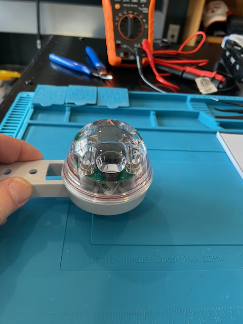
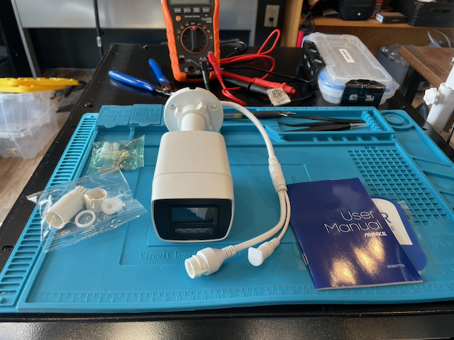
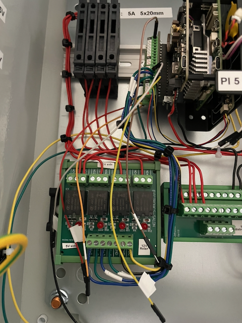

# ORC Station Operator Guide

**For:** PMI field staff responsible for monitoring and maintaining ORC stations
**Sites:** Sukabumi (solar) and Jakarta (AC power)
**Version:** 1.0 — April 2026

---

## Contents

- [What the Station Does](#what-the-station-does)
- [1. Status LED](#1-status-led--is-the-station-ok)
- [2. Normal Operation](#2-normal-operation)
- [3. Checking the Station Remotely](#3-checking-the-station-remotely)
- [4. Power Button](#4-power-button)
- [5. Power Cycle — How the Station Wakes and Sleeps](#5-power-cycle--how-the-station-wakes-and-sleeps)
- [6. Maintenance Mode](#6-maintenance-mode)
- [7. Routine Maintenance](#7-routine-maintenance)
- [8. Troubleshooting — Common Problems and Solutions](#8-troubleshooting--common-problems-and-solutions)
- [9. What NOT to Do](#9-what-not-to-do)
- [10. Sensor Reference](#10-sensor-reference)
- [11. Extending the Station](#11-extending-the-station--available-relay-channels)
- [12. Emergency Contacts](#12-emergency-contacts)

---

## What the Station Does

The station automatically records short videos of the river every 15 minutes,
measures water velocity from the video, and calculates river flow (discharge).
Results upload to a central server over LTE cellular data.

**You do not need to operate the station day-to-day.** It runs unattended.
This guide covers what to check, how to identify a problem, and what
to do about it.

---

## 1. Status LED — Is the Station OK?

The LED is visible through the enclosure window without opening the box.

| LED Color | Pattern | Meaning | Action |
|-----------|---------|---------|--------|
| **Green** | Steady | Healthy, waiting for next capture | None — normal |
| **Green** | Flashing | Capturing video right now | None — normal |
| **White** | Steady | Booting up | Wait 2-3 minutes |
| **Cyan** | Steady | Maintenance mode | Intentional — see Section 5 |
| **Green** | Slow pulse | Shutting down | Normal (Sukabumi between cycles) |
| **Red** | Steady | Camera offline | May be normal (see note below) |
| **Red** | Flashing | Capture failed | See Section 7 |
| **Blue** | Steady/flash | Network/LTE problem | See Section 7 |
| **Yellow** | Steady/flash | Storage problem | See Section 7 |
| **Magenta** | Steady | Power problem | See Section 7 |
| **OFF** | — | No power or sleeping | Normal for Sukabumi between cycles |

**Note on solid red:** A steady red LED means the camera is offline. On
Sukabumi this is **normal between capture cycles**. The camera powers down
with the PoE relay to save solar energy. Solid red is only a problem if the
camera should be on at that time. For example, this is a problem on Jakarta
where the camera runs 24 hours a day, or on Sukabumi during an active
capture cycle.

**General guideline:** Green = good. Any other color for more than 10 minutes =
investigate.

---

## 2. Normal Operation

### Sukabumi (Solar)

The station wakes every 15 minutes, captures a video, processes it, uploads
results, then goes back to sleep. A complete cycle takes about 3 minutes.

What you will see:
1. LED turns white (booting) — ~25 seconds
2. LED turns green flashing (capturing) — ~1 minute
3. LED turns green steady (processing/uploading) — ~1-2 minutes
4. LED turns off (sleeping) — ~12 minutes
5. Repeat

**Between cycles, the station is OFF.** This is normal — it saves solar power.

### Jakarta (AC Power)

The station runs continuously. It captures a video every 15 minutes but stays
powered on between captures.

What you will see:
- LED is green steady most of the time
- LED flashes green briefly every 15 minutes during capture
- Station reboots itself once per day (health check) — you will see white LED
  briefly

---

## 3. Checking the Station Remotely

### Remote Access (Pangolin)

The primary way to access the station dashboard from anywhere with internet:

- **Jakarta:** `https://arc-00001.openrivercam.com`
- **Sukabumi:** `https://arc-00002.openrivercam.com`

This provides HTTPS access to the ORC-OS web dashboard via a secure
remote connection. Open this address in a web browser.
Login password is stored separately (ask Tom).

The dashboard shows recent videos, processing status, and sensor data.

**Note:** We are also evaluating Tailscale as an alternative remote access
solution. Tailscale may be a better fit in some situations but is not usable
in countries that restrict third-party VPN services.

### LiveORC Server

All processed data uploads to: `https://openrivercam.endlessprojects.info/`

Login to see discharge measurements, time series, and video thumbnails from
all stations.

---

## 4. Power Button

Each station has a single waterproof button on the enclosure.

| Action | What happens |
|--------|-------------|
| **Brief press** (Pi is off) | Powers on the station |
| **Brief press** (Pi is running) | Clean shutdown |
| **Long press** (3 seconds) | Enters maintenance mode |
| **Hold 10 seconds** | Forces power off (emergency only) |

**Sukabumi note:** You normally do NOT need the power button. The Witty Pi
schedule handles wake/sleep automatically. Only use the button for maintenance.

---

## 5. Power Cycle — How the Station Wakes and Sleeps

Each station has a **Witty Pi 5 HAT+** board that controls when the Pi
receives power. The Witty Pi has its own clock (CR2032 battery) and runs
independently of the Pi — even when the Pi is completely off, the Witty Pi
is keeping time and waiting for the next scheduled wake.

### How It Works (Sukabumi — Duty Cycled (Repeating On/Off Schedule))

The power cycle has two parts. The Witty Pi board controls when the Pi turns on. The ORC-OS software controls when the Pi shuts down.

1. **Witty Pi turns the Pi ON** at the scheduled time (restores 5V power)
2. The Pi boots, captures video, processes it, uploads results
3. **ORC-OS shuts the Pi DOWN** when processing is complete ("shutdown after task")
4. The Pi is completely off — no power draw except the Witty Pi clock
5. **Witty Pi turns the Pi ON again** at the next scheduled time

The Witty Pi's ON window (for example, 10 minutes) is a **safety limit**.
If ORC-OS does not shut down on its own because of a software hang or crash,
the Witty Pi forces a clean shutdown at the end of the ON window. Under
normal operation, ORC-OS shuts down well before this safety limit activates.

### How It Works (Jakarta — Always On)

Jakarta's Witty Pi is set to "default state when powered = ON." The Pi
stays on continuously. The Witty Pi passes power through without
interruption. ORC-OS reboots the Pi once per day as a health check.

### Available Schedules (Sukabumi)

| Schedule | ON | OFF | Captures/day | Use when |
|----------|-----|------|-------------|----------|
| **prod_15** (default) | 10 min | 5 min | 96 | Normal operation |
| **prod_30** | 25 min | 5 min | 48 | Low solar / conserve battery |
| **maint** | Always on | — | Continuous | Debugging, software updates |

### Changing the Schedule

**This requires SSH access to the Pi via Pangolin or Tailscale.**

1. SSH into the station
2. Run `wp5` (the Witty Pi interactive menu)
3. Select option **6** to choose a schedule file
4. Select the desired `.wpi` schedule
5. The new schedule takes effect on the next power cycle

To check the current schedule:
```bash
wp5
```
Option **7** shows the current schedule status.

**To switch Jakarta to duty-cycle mode** (e.g., if moved to solar power in
the future): load a `.wpi` schedule file and set ORC-OS "Shutdown after task"
to ON.

**To switch Sukabumi to always-on** (for extended maintenance): load the
`maint.wpi` schedule. Remember to switch back to `prod_15.wpi` when done.

---

## 6. Maintenance Mode

Maintenance mode **suspends video capture**, which also suspends the
ORC-OS "shutdown after task" behavior. This is useful for debugging,
software updates, or any work where you do not want the station capturing
or shutting down mid-task.

> **Important:** Maintenance mode does NOT change the Witty Pi schedule.
> On Sukabumi, the Witty Pi will still cut power at the end of its ON
> window (e.g., after 10 minutes) even in maintenance mode. If you need
> the station to stay on longer than one Witty Pi cycle, you must also
> load the `maint.wpi` schedule (see Section 5).

### Entering Maintenance Mode

**Option A — Power button:** Long press (3 seconds). LED turns cyan.

**Option B — Remote (GitHub):** Someone with repository access changes the
station's mode file from "production" to "maintenance" at:

`https://github.com/tom-jordan23/orc-pmi-stations`

Use the "Set Station Mode" workflow (Actions tab) to toggle a station between
production and maintenance. The station picks up the change on next boot.

### What Changes in Maintenance Mode

- Video capture stops (no video recording from the camera, no camera power switching)
- ORC-OS "shutdown after task" is effectively disabled (nothing to trigger it)
- ORC-OS web dashboard stays accessible
- LED shows cyan
- **Witty Pi schedule is unchanged** — the Pi will still power off at the
  end of the ON window unless you load `maint.wpi`

### For Extended Maintenance on Sukabumi

To keep the station on indefinitely:
1. Enter maintenance mode (button or GitHub)
2. SSH in via Pangolin and load the maintenance schedule: `wp5` → option 6 → `maint.wpi`
3. The Witty Pi will now keep the Pi powered continuously
4. When done: load `prod_15.wpi`, set station back to "production", reboot

### Exiting Maintenance Mode

- Change mode back to "production" on GitHub and reboot, OR
- Reboot the Pi (`sudo reboot` via SSH)
- On Sukabumi: also restore the production schedule (`prod_15.wpi`) if you changed it

---

## 7. Routine Maintenance

### Monthly

- [ ] **Visual check:** LED is green? Enclosure intact? No water intrusion?
- [ ] **Camera lens:** Clean with microfiber cloth if dirty (insects, dust, rain spots)
- [ ] **Rain gauge dome:** Wipe clean if debris has accumulated (leaves, bird droppings)
- [ ] **Cable glands:** Visually inspect — no cracking, no loose fittings
- [ ] **Check LiveORC:** Log in and verify recent data is uploading

### Quarterly

- [ ] **Open enclosure** — read the warning below first:

  **WARNING: Opening the enclosure in humid conditions can cause damage.**
  The enclosure uses GORE vents to equalize pressure while keeping water
  out. The air inside the box is drier than the outside air. When you open
  the lid, humid tropical air rushes in. If the electronics are cooler than
  the incoming air (e.g., after a cool night or rain), moisture will
  **condense on the circuit boards** — this can cause shorts and corrosion.

  **Rules for opening the enclosure:**
  - **Do not open if ambient humidity is above 70% RH** (use a weather app
    or the SHT40 reading from the dashboard to check)
  - **Never** open during or immediately after rain
  - Open during the **warmest, driest** part of the day (midday sun)
  - Take your time once open — the air exchange happens immediately when
    the lid opens. Working quickly does not prevent this.
  - If you see condensation on any component, close the lid immediately
    and let the GORE vents remove moisture over the next 24 hours
  - Enter maintenance mode before opening (prevents capture cycles
    during service)

  Once open, check:
  - Moisture, insects, corrosion inside
  - Terminal blocks — no loose wires
  - Fuses — no discoloration
  - LED and sensors are clean
- [ ] **Sukabumi solar:** Clean solar panel if dirty. Check battery voltage
  (should be >12V). Inspect cable connections at battery terminals.

### After Storms

- [ ] Check station is still operating (LED green)
- [ ] Check camera is still aimed correctly (has not shifted)
- [ ] Check rain gauge has not been displaced from its mount
- [ ] Check enclosure for water intrusion
- [ ] **Jakarta:** Check AC power is on (building may have tripped breaker)

---

## 8. Troubleshooting — Common Problems and Solutions

### Station LED is OFF (no light at all)

1. **Sukabumi:** May be sleeping between cycles. Wait 15 minutes — if LED
   does not come on, press power button briefly.
2. **Jakarta:** Check AC power is on at the building breaker.
3. Press power button briefly. If nothing happens, open enclosure and check
   fuses (see door sheet inside lid).

### LED is RED (camera problem)

1. Camera may need time to boot. Wait 5 minutes.
2. Check that the ethernet cable between enclosure and camera is connected.
3. Open enclosure → check the PoE switch has power (green LED on the switch).
4. If PoE switch is dark, check fuse F2 (5A).

### LED is BLUE (network problem)

1. LTE modem may need time to connect. Wait 5 minutes.
2. Check antenna — is it connected and not damaged?
3. If problem persists, check SIM card (open enclosure, inspect modem).
4. Verify cell coverage at site has not changed.

### LED is YELLOW (storage problem)

1. Storage may be full. Connect to web dashboard and check disk space.
2. If disk is full, old videos should auto-clean. If not, contact Tom.

### LED is MAGENTA (power problem)

1. **Sukabumi:** Battery may be low. Check if solar panel is clean and
   unobstructed. Check battery voltage (should be >12V).
2. **Jakarta:** Check AC power. May be a temporary drop in power voltage.

### No data on LiveORC server

1. Station may be working but LTE upload is slow. Wait 1 hour.
2. Check station LED — if green, station is healthy. Problem is connectivity.
3. Check if SIM card has data remaining (prepaid plans expire).
4. Remote-access the station via Pangolin and check upload status.

### Camera image is dark or blurry

1. Clean the camera lens (microfiber cloth).
2. Check that nothing is blocking the camera view (new vegetation, spider webs).
3. IR LEDs handle night vision automatically — no adjustment needed.

---

## 9. What NOT to Do

| Do NOT | Why |
|--------|-----|
| Disconnect wires inside the enclosure | You may connect them wrong and damage the Pi |
| Change any software settings without guidance | The system is carefully configured |
| Open the enclosure in rain | Water intrusion damages electronics |
| Force-hold the power button regularly | Use brief press for clean shutdown |
| Disconnect the rain gauge cable | It accumulates data that would be lost |
| Point the camera at a different angle | Requires complete recalibration (field survey) |
| Swap SD cards between stations | Each card is configured for its station |
| Connect power to any terminal marked "GPIO" | 12V on GPIO pins destroys the Pi instantly |

---

## 10. Sensor Reference

### Rain Gauge (Hydreon RG-15)

- Mounted outside the enclosure
- Optical sensor — no moving parts, self-cleaning dome
- Measures rainfall intensity and accumulation
- Stays powered 24 hours a day (even when Pi sleeps on Sukabumi)
- **Cleaning:** Wipe dome with damp cloth. Do not use solvents.
- **Disconnect:** SD16 4-pin connector (keyed, waterproof). Unplug to replace
  gauge without opening enclosure.



*Figure: The RG-15 rain gauge. The clear dome is the sensing surface — keep it clean. No moving parts inside.*

### Temperature/Humidity (SHT40)

- Mounted inside the enclosure
- Monitors internal conditions (humidity alert threshold)
- No maintenance required

### Outside Temperature (DS18B20)

- Waterproof probe mounted outside the enclosure
- Passes through PG9 cable gland
- No maintenance required



*Figure: The ANNKE C1200 PoE camera installed at each site. Factory-sealed IP67 housing with built-in IR LEDs for night operation.*

---

## 11. Extending the Station — Available Relay Channels

Each station has a 4-channel relay module. Only **channel 1** is used
(PoE camera power). **Channels 2, 3, and 4 are available** for future use.

### What the Relays Can Do

Each relay channel is a switch that separates the low-voltage control circuit
from the 12V power circuit. The Pi controls each relay via a GPIO (input/output) pin. When the Pi sets the pin HIGH, the relay closes and connects
power to whatever is wired to it. When the pin goes LOW (or the Pi loses
power), the relay opens and the load loses power.

- **Switching capacity:** 12V DC from the station's power bus (TB1)
- **Each channel is independent** — they can be on/off in any combination
- **Fail-safe** (designed to turn off safely when power is lost)**:** All relays open (loads off) if the Pi crashes or loses power
- **Control:** Any script or service on the Pi can toggle a relay by setting
  a GPIO pin high or low

### Ideas for Future Use

**Alerting and notification:**
- Wire a relay to a siren, strobe light, or warning beacon. Trigger it from
  software when the river level exceeds a threshold. The relay can power a
  12V alarm device directly from TB1.
- Wire a relay to a cellular SMS gateway module (12V powered). Send automated
  text messages during flood events.

**Additional instruments:**
- Power a water level sensor on a duty cycle (turn on to take a reading, turn
  off to save power). Useful for Sukabumi where solar budget is limited.
- Power a second camera for a different view angle or a wider scene.
- Power a 12V solenoid for automated water sampling.

**Integration with other systems:**
- Use a relay as a simple on/off switch output (the relay only opens and closes
  a circuit) to interface with existing telemetry or SCADA (industrial
  monitoring) systems. The relay's NO/NC terminals can signal to any system
  that reads on/off switch signals.
- Power a 12V radio or LoRa transmitter for local data relay to a nearby
  station or gateway.

### How to Connect a New Load

**This requires opening the enclosure. Only trained personnel should do
this. See Section 6 for humidity warnings about opening the enclosure.**

The GPIO control wiring from the Pi to relay inputs IN2, IN3, and IN4 is
**already done** on both stations. You only need to wire the 12V load side.

Each unused relay channel has three screw terminals on the 12V output side:

| Terminal | Function |
|----------|----------|
| **COM** (Common) | Connect to 12V+ from TB1 (through a fuse) |
| **NO** (Normally Open) | Connect to your 12V load (+) |
| **NC** (Normally Closed) | Not used (leave empty for fail-safe behavior) |

The load's ground wire returns to TB1 GND.

**Always add a fuse** between TB1 and the relay COM terminal. Match the fuse
to the load's current draw (e.g., 2A fuse for a 20W load at 12V).

To control the relay from the Pi (command line):
```bash
# Turn on relay channel 2 (GPIO 17)
gpioset gpiochip0 17=1

# Turn off
gpioset gpiochip0 17=0
```



*Figure: Inside the enclosure. The relay module (green PCBs, center) has four channels — CH1 powers the camera, CH2-4 are available. Each has COM/NO/NC screw terminals on the 12V side.*

### Relay Channel Assignments

| Channel | GPIO | G469 Pin | Status |
|---------|------|----------|--------|
| CH1 | GPIO 24 | Pin 18 | **In use** — PoE camera power |
| CH2 | GPIO 17 | Pin 11 | Available — GPIO wired, no load |
| CH3 | GPIO 27 | Pin 13 | Available — GPIO wired, no load |
| CH4 | GPIO 22 | Pin 15 | Available — GPIO wired, no load |

These assignments are the same on both stations.

### Important Notes

- **Do not exceed 12V or 10A per channel** on the relay contacts
- **Always use NO (Normally Open)** contacts for fail-safe behavior — loads
  turn off if the Pi loses power
- **Add a fuse** on every new load circuit
- **Label all new wiring** clearly at both ends
- **Document what you connected** — update the door sheet inside the enclosure
- **Test before leaving the site** — verify the relay toggles and the load
  responds

---

## 12. Emergency Contacts

| Role | Name | Phone | Email |
|------|------|-------|-------|
| Technical lead | Tom Jordan | *(fill in)* | *(fill in)* |
| PMI site contact (Sukabumi) | | | |
| PMI site contact (Jakarta) | | | |

### If the station is completely unresponsive:

1. Note the LED color (or that it's off) and the time
2. Take a photo of the station and any visible damage
3. Contact Tom with the photo and description
4. **Do not open the enclosure or disconnect anything** unless instructed

