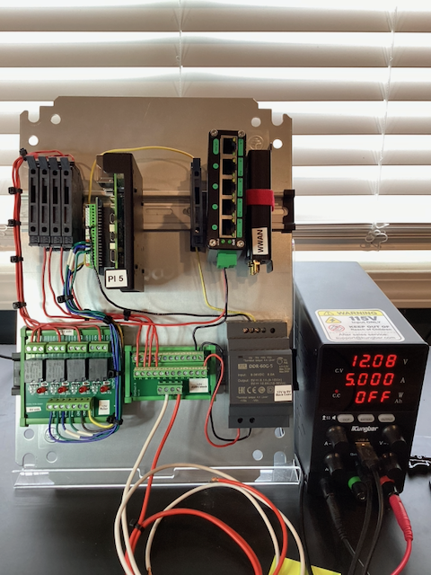
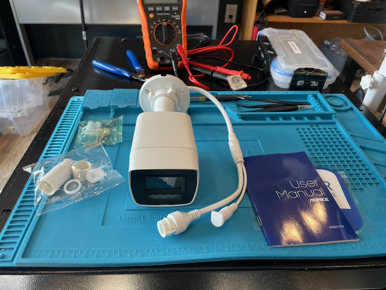

# Recommendations for Replication of the OpenRiverCam Station Design

**Version:** 2026-08-31 (draft for internal review — not yet circulated)

**Prepared for:** Institut Pertanian Bogor (IPB) and Balai Hidrologi dan
Lingkungan Keairan (BHLK), following the PMI / IPB / BHLK meeting at Sukabumi,
21 August 2026.

**Companion document:** *Appendix — Recommendations for Replication of the
OpenRiverCam Station Design*, which holds the supporting measurements, interface
detail and procedures referenced from the sections below.

---

## Executive Summary

At the meeting held at Sukabumi on 21 August 2026, BHLK offered to duplicate one
to three OpenRiverCam (ORC) devices as a pilot, offered server capacity for ORC
data, and recommended relocating the present site to an open area free of
obstruction. This document responds to those offers. We welcome all three, and
this report is written to give BHLK and IPB an accurate basis for the decision
rather than an encouraging one.

**What is being offered for study.** A river-monitoring station built from
commodity parts at **USD 1,340 in materials** (solar) or approximately **USD 1,030**
(mains-powered), producing water level and discharge from video. For comparison,
the lowest-cost automatic water-level station on the Indonesian government
e-catalogue is listed at approximately **USD 3,600 ex-VAT** and measures stage
only. The design's value is in what that price does for network density.

**The evidence base is narrow and should be treated as such.** One deployed
station, on one river, across part of one season, running a calibration that is
not certified for absolute discharge. This report states its limits throughout
and identifies what remains unresolved.

**This document is confined to the technology.** It reports what the station is,
what it did in the field, and what should change in the hardware and software
before duplicate units are built. What the resulting data is fit to support, and
what accuracy any given application demands, are for IPB, BHLK and their partners
to determine; where a measurement requirement appears below it is one recorded
from them, not proposed by us.

**Four findings shape the recommendations.**

1. **The survey method failed reproducibly on site, and nothing in the workflow
   caught it there.** Two RTK surveys at Sukabumi, on consecutive days with the
   same equipment and crew, produced check-point spreads of about 99 cm horizontal
   and 139 cm vertical — roughly 30 times the applicable tolerance. The surveyed
   geometry is an input the processing chain cannot recover, which makes a
   professional survey — **Rp 5–15 million per site** — a prerequisite rather than
   an improvement.
2. **Optical water-level detection fails throughout daylight at the present
   site**, and because water-level estimation aborts the whole processing run,
   each failure costs the entire discharge measurement rather than only the
   level. Every duplicated unit should carry an independent water-level
   reference.
3. **The 30-minute duty cycle, imposed by solar operation, is the common cause
   behind most of the reliability record.** It also bounds how often the station
   can report, because every wake pays a fixed camera boot before any video
   exists. Where continuous or frequent reporting is intended, an always-on
   mains-powered station is both more capable and cheaper.
4. **Cost minimisation applied component by component has a measurable price.**
   The camera selected meets every line of its specification and still costs the
   system a fifth of its video bitrate, a slower measurement cadence, and 30–60
   seconds of battery on every wake — none of which appear in the comparison that
   selected it.

**The recommendations**, in full at §5 and summarised at §11, are eleven. The four
with the greatest effect on the pilot's reliability and on the quality of what it
produces are: fit an independent water-level reference (**R1**); commission a
professional survey before the first installation (**R2**); publish interface
specifications and substitution rules so units can be sourced in Indonesia without
re-engineering (**R3**); and, where real-time monitoring is required, build
always-on and mains-powered (**R11**).

**What is proposed on the other two offers.** BHLK's server capacity is well
matched to the pilot and in-country hosting carries a clear data-sovereignty
benefit; §7 sets out the two operational constraints that should be planned for.
BHLK's recommendation to relocate to an open site is supported, and §8 adds
independent evidence for it from the survey and camera records.

---

## 1. Purpose and status

This document responds to the request recorded on 21 August 2026 that BHLK
duplicate one to three ORC devices as a pilot, and to the request for access to
the current design in order to study it.

It contains the station design as built and deployed, the field record from April
to August 2026 including its failures, and recommendations for what should change
before duplicate units are built. Supporting measurements and procedures are in
the companion appendix.

The evidence base is narrow, and the limits are worth stating at the outset. There
is one deployed station, at Sukabumi, on one river, observed across part of one
season; a second was built but not deployed; and the discharge calibration
currently running at Sukabumi is a salvage calibration, not certified for absolute
flow. Where a recommendation rests on a single observation, this document says so.

Sukabumi is a technology pilot and is not yet contributing data to any operational
product. The value of the deployment to date therefore lies in what it has
revealed about the design rather than in the measurements it has produced, and
this document reports the failures on that basis.

One point of context shapes several of the recommendations. The station is
volunteer-supported, operated remotely and visited rarely — the normal condition
for this class of deployment, and the likely condition for a BHLK pilot. The
design must therefore tolerate long unattended periods, recover from routine
faults without a person, and make its own state visible without anyone going to
look. Where the field record shows a fault persisting, the finding is that the
design assumed attention it should not have assumed.

The scope is deliberately narrow. This document reports the design, what it did in
the field, and what should change in the hardware and software before duplicate
units are built. It does not assess what the resulting data is fit for, or what
measurement accuracy any particular application demands. Those judgements belong
with IPB, BHLK and their partners; where a measurement requirement is stated
below, it is one recorded from them rather than proposed by us.

Permission to study and duplicate the design, and the licensing terms that would
apply, are being handled separately from this document.

## 2. What the pilot requires of the design

The purposes recorded at the meeting are for IPB, BHLK and their partners to
define. What follows is only the consequence for the equipment: three properties
of the technology that any duplicated unit has to be built around, stated without
reference to what the output is used for.

**Surface velocimetry depends on trackable features on the water surface.** The
technique recovers velocity by tracking patterns between video frames, so its
performance varies with the state of the surface rather than being a fixed
property of the camera. That performance has not been characterised at Sukabumi.
It should be measured at the pilot sites, across the range of conditions those
sites present, rather than assumed to carry over from the published literature.

**The surveyed geometry is an input the processing chain cannot recover.**
Discharge is computed from surface velocity and a cross-sectional area taken from
a survey. An error in that survey propagates through to the result, and no
downstream processing removes it, because there is nothing in the video that
constrains the bed. Whatever accuracy is required of the output is therefore
bounded below by the survey — which is why R2 is placed where it is.

**Reporting cadence is a design parameter, separate from measurement quality.**
How often a station reports is set by its power architecture rather than by its
optics. On a solar duty-cycled station the two are in tension: every wake pays a
fixed 30–60 second camera boot before any video exists, so shortening the cycle
raises energy consumption faster than it raises sample rate. Whatever cadence an
application needs should be treated as a requirement on the configuration chosen
at the outset, not as something that can be tuned afterwards. R11 addresses this
directly.

## 3. The design as built, its cost, and the cost ceiling

### 3.1 The design

A PoE camera on a pole views the river section. A Raspberry Pi 5 in a weatherproof
enclosure runs scheduled power management and on-station video processing to
derive surface velocity and discharge, and an LTE link uploads video and sensor
data to a central server. The station is duty-cycled: it wakes on a 30-minute
schedule, captures, processes, uploads, and powers down. Sukabumi is solar-powered
with a LiFePO4 battery.

Five constraints governed every component choice, and they are the reason the
design is replicable at all: commodity electronics only, with no custom circuit
boards and no single-source parts; no soldering, all connections by screw
terminal, plug or header; no specialist assembly skills; common tools only; and
any component replaceable in five minutes.

<figure class="photo-row">

<figcaption>The five constraints in practice. Every part is a stock item, and every
connection is a screw terminal, a plug or a header — the reason the design can be
duplicated at all. Left: the parts for one station before assembly. Right: the same
parts wired onto the mounting plate, under bench power at 12.08 V.</figcaption>
</figure>

### 3.2 The cost ceiling, and how it was applied

The project had approximately **USD 3,000 of materials budget for two stations**,
setting a working ceiling of **USD 1,500 per station**. Sukabumi as built came to
**USD 1,340** in its solar configuration; a mains-powered configuration, omitting
panel, charge controller and battery, is approximately **USD 1,030**. These are
materials only, and exclude shipping, duty, labour, the pole and civil works, and
the survey.

For comparison, the lowest-cost automatic water-level station confirmed on the
Indonesian government e-catalogue (INAPROC) is the domestically assembled IDDATA
RL03 radar unit with GSM telemetry, at **Rp 58,000,000, approximately USD 3,600
ex-VAT**. The comparison is not like for like — the RL03 is a production-supported
commercial instrument measuring stage only, while the ORC station is a pilot-stage
assembly producing stage and discharge. The reason it is worth stating is network
density: how many stations a basin authority can afford determines how much of a
catchment is instrumented, which is a different question from how good any single
station is.

**How the ceiling was applied, and where the method is weak.** The ceiling was
applied component by component — for each function, the cheapest part meeting the
stated requirement. This is defensible and it produced a working station at USD
1,340. It has one specific failure mode, which this deployment demonstrated:
**it prices each component against its datasheet, and not against what that
component's limitations cost the rest of the system.** A part can meet every
requirement on the list and still impose costs in energy, in data rate, and in
what can be diagnosed remotely, none of which appear in the comparison that
selected it.

### 3.3 What the camera choice cost

The camera is the clearest case, and the one where the ceiling left least room for
judgement. The camera selected was purchased as a two-pack at about **USD 60 per
unit**. A professional-grade 12MP alternative evaluated during selection listed at
approximately **USD 1,268** — roughly twenty times the price, and on its own more
than four-fifths of the per-station budget. At that ratio the selection was not a
judgement between options.

<figure class="photo photo-right">

<figcaption>The camera as delivered. Capable hardware from a major manufacturer,
running a reseller's rebranded firmware — which is where all three limitations
below originate. Appendix Figure A1 shows what that costs the capture path.</figcaption>
</figure>

The unit is an OEM product: capable hardware from a major manufacturer, running a
reseller's rebranded firmware. What the rebrand also does is remove parts of the
control interface that the manufacturer's own firmware exposes. Three consequences
followed, all properties of the firmware rather than of the optics or sensor:

1. **Recorded video cannot be retrieved over HTTP, which costs video quality.**
   The intended design had the camera record to its own card at full bitrate and
   the station pull the file over Ethernet faster than real time. The one interface
   call this needs is absent from the rebranded firmware, so capture falls back to
   a live stream carrying 10–20% transport overhead. The station delivers about
   **15.5 Mbps against a 16 Mbps target, where the processing chain recommends
   20 Mbps** — below the recommended bitrate for the measurement it exists to make.
2. **A white light fires at full brightness on every power-on and cannot be
   disabled.** It is a hardware self-check running before the operating system
   loads, so no configuration reaches it, and masking it also blocks night vision.
   At an urban canal with residences on both banks, this constrains how often the
   station may wake. Continuous camera power was rejected: it raises consumption
   from 118 to **425 Wh/day** and cuts autonomy below one day.
3. **Boot time is fixed and paid on every wake** — 30–60 seconds, on a station
   whose normal wake is about two minutes, spent before any video exists.

*Appendix A1 gives the interface detail, the profile measurements, every approach
tested against the boot light, and the boot-time figures.*

### 3.4 Replacing the camera firmware

Because the first limitation is a firmware restriction on otherwise capable
hardware, replacing the firmware was investigated as a way to recover the intended
capture path. It was documented in full as a contingency and **was not carried
out**. The expected gain was 15–25% higher effective bitrate; whether that converts
into materially better velocimetry was never tested.

One point of terminology, since it affects how the option is assessed: what was
researched was cross-flashing the **original manufacturer's** firmware onto the
rebranded hardware — unofficial vendor firmware, not an open-source stack.
Open-source firmware projects exist for some camera systems-on-chip, but none was
evaluated against this hardware. The risks arise from the act of replacement
rather than from the licence of what is loaded, so they apply either way.

The reasons it was not done, in order of weight: a failed flash can require opening
an IP67-rated housing to recover, itself a reliability event; the procedure is
specific to particular hardware revisions, so a later procurement batch may not
match; the authoritative procedure is a community forum thread with no vendor
support path; warranty is void; and a reflashed camera and a factory spare no
longer accept the same configuration, so every spare must be flashed to match —
handing a bricking risk to whoever maintains the station locally, and conflicting
with the constraint that any component be replaceable in five minutes with common
tools. It also does not fix the boot light, which sits below the firmware.

**The rule we would offer from this.** Treat firmware replacement as a last resort,
not a design assumption. Where a capability is needed, select a camera that exposes
it. *Appendix A2 gives the full risk analysis and, should it be attempted
regardless, the prerequisites and verification order.*

## 4. Field record, April to August 2026

This section reports what the deployed station did, and reads each result as a
property of the design rather than of its operation. Where an earlier attribution
has since been withdrawn, it is identified as withdrawn. *Appendix A4–A6 hold the
underlying records.*

### 4.1 A missed wake cycle does not self-correct

Across **133.5 days observed (2026-04-16 to 2026-08-28)** there were **13 discrete
interruptions**, reconstructed from the sensor rows the station writes on every
wake. The informative property is not the count but the duration distribution:

| Duration | Count |
|---|---|
| Under 24 hours (one or a few missed cycles) | 9 |
| 24–48 hours | 1 |
| 2–5 days | 0 |
| 5 days and over | 3 |

**The absent middle is the signature of a latch.** A missed wake leaves the
scheduler's next-startup alarm in the past, and nothing re-arms it. The station
therefore either catches the next cycle within a day, or stops until something
external restarts it — the three long ones ran 5.4, 7.3 and 9.3 days.

That makes two separable faults. **The trigger** — whatever kills the individual
wake, most likely a brownout — is a power sizing question. **The latch** — the
failure to re-arm — is a scheduler question, and fixing it converts an open-ended
interruption into a 30-minute one whatever the trigger was. The latch is the
cheaper half and the higher-value one; R10 and R11 both bear on it.

**Nothing in the design made any of this visible.** No mechanism existed by which
an interruption could announce itself, so the record could only be reconstructed
afterwards by querying the database directly. A fault the system does not report
cannot be detected by monitoring it. R4, R5 and R7 address this.

### 4.2 Attribution

**Nine of the 13 interruptions coincide with maintenance mode being active.** This
is a remotely-set flag that suppresses capture and holds the processor awake for
the full scheduled window — roughly **12 times** the energy of a normal wake, and
no data. Long-wake events run at **1.59 per hour inside maintenance windows
against 0.18 per hour outside**. The nine include the two longest interruptions.

**The design defect is that the mode has no expiry and no alarm.** It persists
until explicitly cleared, indicates nowhere that it is set, and its energy cost is
invisible. It remained set across multi-day periods, which is the predictable
outcome of a mode that depends on someone remembering to clear it on a station
they cannot see. A mode this expensive should time out on its own and appear in
routine telemetry while active; both are straightforward to add.

Four interruptions are not associated with maintenance mode, of which two remain
unexplained and carry its full energy signature without the mode being set.

**One earlier inference is withdrawn.** An earlier analysis reported a strong
statistical association between long wake events and interruption onsets and read
it causally. The association is real, but maintenance mode was generating both
terms. The chain from extended runtime to drain to interruption still stands on
the evidence of the maintenance windows themselves, not on that correlation.

### 4.3 Daytime water-level failure

Sukabumi has no water-level sensor and estimates water level optically from the
video. Over 2026-07-08 to 07-14, of 200 sampled captures, every failure was
rejected at the same quality gate — a signal-to-noise threshold of 2.0. That the
two populations separate at the gate is definitional rather than a result, so the
informative quantity is where each sits relative to it. **Failures are not
marginal cases resting just under the line:** their median is 1.63, and only 23 of
the 100 reach 1.8. Lowering the gate would therefore recover few of them while
admitting water levels the detector had no confidence in. The converse is also
worth recording: **36 of the 100 passing captures fall between 2.0 and 3.0**, so a
substantial share of accepted water levels are themselves close to the
threshold.

**All failures occur in daylight; night captures pass reliably.** Zero failures
occurred between 19:00 and 06:00 WIB. Within daylight, failures show two peaks —
mid-morning and mid-afternoon — with a dip at solar noon.

The failure is measured and not in doubt. Its cause is a well-supported hypothesis
rather than a settled result: that shape is the geometric signature of **specular
sun glint**, because a general brightness effect would track sky brightness rather
than sun angle and would not produce the midday dip. Direct visual confirmation is
pending. **The recommendation depends only on the failure, not on the mechanism.**

Because water-level estimation aborts the entire processing run, each daytime
failure costs the **whole discharge measurement**, not only the level.

### 4.4 Data delivery

**Approximately half of all captured video never reached the server.** Of 5,406
videos recorded between 2026-04-08 and 2026-08-27, **51% were never
synchronised**, and separately 43% failed processing on the station. The station
disk sat pinned at its automatic purge threshold throughout, so records were
deleted before they could be retransmitted. Nothing in the design compared what
was captured against what arrived, so this produced no symptom at either end.

A separate 12-day gap in the video record occurred while the station was operating
normally and logging sensor data throughout; it is very likely server-side.

The general point for a replicated design is that **video and sensor data travel
independent paths and fail independently**, and neither confirms the other. Both
have been observed at Sukabumi.

## 5. Recommendations for the pilot units

These are offered for consideration by BHLK and IPB, ordered by their effect on
the pilot's reliability and on the quality of what it produces, each with its
supporting observation and the cost of adopting it. Where the pilot requires
real-time or near-real-time monitoring,
**R11 should be read first** — it changes what several of the others are solving
for.

**R1 — Fit an independent water-level reference; do not depend on optical
detection.** Either a level sensor, or a staff gauge within the camera view
referenced to the local *papan duga air* zero. *Basis:* §4.3 — optical detection
fails throughout daylight, and each failure costs the whole discharge measurement.
*Effect:* without it the station measures reliably only at night. The loss is
systematic rather than random — the same block of hours is missing from every day,
which is a different problem from a lower overall yield and is not fixed by
capturing more often. *Cost:* a staff gauge is cheaper and aligns with existing BBWS
practice, but depends on being readable from the image, which is not yet
established (§10); a sensor is the lower-risk option.

**R2 — Commission a professional survey before the first installation.** Survey
accuracy sets the lower bound on discharge accuracy, and no downstream processing
recovers it. *Basis:* two RTK surveys at Sukabumi on consecutive days, same
equipment and methods, both produced check-point spreads of about **99 cm
horizontal and 139 cm vertical**, exceeding the applicable tolerance by roughly 30
times. What the station runs on today is a salvage calibration recovered from a
six-point subset at 4.61 cm RMSE — not a survey delivered to specification.
*Cost:* **Rp 5–15 million
per site.** *Two supporting points:* carry an independent in-field check of a
different type, so a failed survey is caught on site rather than in
post-processing; and if a method fails once at a site, change the method — the
Sukabumi failure reproduced exactly with the same equipment and crew. *Appendix A3
gives the scope of work, acceptance checks and contract terms.*

**R3 — Build to interfaces, not to part numbers.** Publish an interface
specification alongside the bill of materials: which parameters bind — voltage,
current, ingress protection, operating temperature — and which do not, such as
brand, form factor and mounting style. *Basis:* the design was documented as exact
part numbers and suppliers, which works with access to the original suppliers and
broke down in the field; under schedule pressure a substitution changed the power
architecture with no written rule to evaluate it against. *Effect for this pilot:*
BHLK will source in Indonesia under Indonesian procurement rules including
domestic-content policy, so substitution is the expected case rather than a risk to
be managed — and without written rules every substitution becomes an engineering
question referred back to us. *Cost:* documentation only.

**R4 — Specify health telemetry and mode alarms as functional requirements.** Any
mode that suppresses data or raises energy consumption must be remotely visible,
must raise an alert when it persists, and should expire automatically rather than
remain set until cleared. *Basis:* §4.1 and §4.2. *Cost:* negligible — the
maintenance flag was readable from a public interface throughout, without
contacting the station.

**R5 — Have the station push diagnostics rather than requiring a login.** A
duty-cycled station may be awake only tens of seconds per cycle, which is not long
enough to establish an interactive session; at Sukabumi a station that was awake
and uploading was classified as unavailable because the diagnostic route depended
on a connection that never opened inside the wake window. No polling rate fixes a
window that short. *Cost:* small.

**R6 — Instrument the power system; record voltage and current as paired
samples.** Voltage alone cannot separate a battery fault from a load fault, and
this blocked the Sukabumi investigation repeatedly. *Size for the worst case:* the
sleep-phase budget was understated by 25% — corrected consumption is **118 Wh/day
against 94 Wh/day estimated**, reducing autonomy from 3.2 to **2.5 days**. Autonomy
drives the maintenance and alerting plan, so an error of this size propagates into
both. *Cost:* a current-sense module and its logging.

**R7 — Reconcile captured data against received data automatically.** The station
knows what it captured; the server knows what it received; compare them on a
schedule and alert on the difference. *Basis:* §4.4 — half of all captured video
never arrived, and the divergence produced no symptom at either end. *Cost:*
negligible.

**R8 — Consider siting compute indoors for the pilot units.** Place camera and
sensors at the river and the processing computer indoors at a BHLK or IPB
facility, connected over a network link. This reduces field installation to
mounting a camera and providing a network path, and places the processing hardware
where temperature, humidity, dust and access are controlled — the primary
reliability risks for outdoor electronics in a tropical deployment. *Stated
honestly:* the configuration is designed but **not field tested**, and is offered
as the pilot's first experiment rather than a proven alternative. *A related
point:* where the field node is a standard IP camera, installation falls within
the existing Indonesian security-camera supply chain, with local support and a
deeper supplier base than specialist hydrometric equipment — and it lowers the
site permission ask from an enclosure, battery and modem to a camera.

**R9 — Set the cost ceiling per station, and check the control interface before
buying.** Keep a hard per-station budget — it is what makes network density
achievable — but apply it to the station rather than to each component in
isolation, and add one screening step for any component under software control:
confirm the interface you need is exposed on the firmware the unit actually ships
with. *Basis:* §3.2 and §3.3. *What to check for a camera:* whether recorded files can
be retrieved and not only streamed; whether the illuminator can be disabled in all
modes including at power-on; the cold-boot time to first frame; and whether the
vendor's own firmware rather than a rebrand of it is what ships. For a duty-cycled
station these four determine the energy cost and data quality of every
measurement. *Cost:* screening effort, and some willingness to pay more per
camera — though not necessarily the premium end, since the professional
alternative here was twenty times the price. The aim is the cheapest unit that
exposes what the application needs, which is a different search from the cheapest
unit meeting the datasheet.

**R10 — Use the Raspberry Pi's native real-time clock in place of an external
scheduling board where the site allows.** *Basis:* this was the original design
for both stations. The external board was reinstated late in the build for one
reason — the Pi's small RTC battery connector **failed on both boards** — and not
because the native clock was inadequate. *Why it is worth returning to:* it removes a board, its cell and roughly USD 50
per station, and changes the failure mode behind §4.1 — a wake alarm written by the
operating system at shutdown makes re-arming part of the normal shutdown path
rather than a separate mechanism that can be left stale. This should be verified
rather than assumed. *Where the external board should be kept:* on a solar site it
is doing real work — cutting power entirely rather than leaving the Pi in standby,
accepting 6–30 V directly from the battery bus, and providing low-voltage and
temperature cut-offs with no native equivalent. The native clock is the better
choice for **mains-powered installations and the indoor-compute configuration in
R8**. *One caution:* that connector failed twice out of two, so treat it as
handling-sensitive and hold a scheduling board in spares. *Appendix A7.2 gives the
full comparison.*

**R11 — Where real-time monitoring is required, build an always-on, mains-powered
station.** If a pilot unit is intended to support real-time or near-real-time
monitoring, site it where mains power is available and run it continuously rather
than duty-cycling it. We would treat this as a requirement for those units rather than
a preference.

*Basis: the duty cycle is the common cause behind much of §3 and §4.* It bounds
the achievable cadence at 30 minutes: every wake costs a 30–60 second camera boot,
and shortening the cycle raises energy consumption faster than it raises sample
rate, so a shorter cycle is not available by configuration alone. It creates the
latch, since a station that does not sleep has no wake to miss (§4.1). It defeats
remote diagnostics, since the wake window is too short to open a session (R5). And it is what forces the camera constraints in
§3.3: on mains power the boot penalty disappears and the boot light fires once at
installation rather than 48 times a day.

*Cost: it is cheaper, not more expensive* — approximately **USD 1,030 against USD
1,340**. The real cost is siting: the station must be within reach of reliable
mains power, which constrains site selection (§8) and may conflict with the
preferred measurement section. Where mains is present but unreliable, add a UPS
sized to the observed outage duration.

*How it interacts:* it pairs directly with **R8** — together the most robust
configuration available from this design — and makes **R10** straightforward. It
does not displace **R1**, **R2** or **R7**: an always-on station with a poor survey
and no independent water-level reference produces uncertain discharge
continuously. For sites where mains power is not available the solar design
remains the option, with the limitations recorded in §4. The point is that the two
cases should be designed as two configurations, not one design deployed to both.

## 6. Output conditions the design must satisfy

The conditions below are the ones the BBWS record is kept to. They are reproduced
here because they constrain the design, the bill of materials and the installation
procedure, and a duplicated unit that does not carry the necessary hardware cannot
meet them later. Whether ORC output should be accepted into that record, and on
what terms, is not assessed here.

**Conditions recorded for output to be additive to BBWS time series:**

- Stage in **metres above local datum**, referenced to the same *papan duga air*
  zero BBWS uses at the site, at 1 cm resolution or better.
- **15-minute time step minimum**, 5-minute preferred, for compatibility with
  SIH3 / SIHLSDA ingest. The station as built reports on a 30-minute cycle; §2 and
  R11 give what sets that figure and what it would take to change it.
- Discharge in **m³/s**, with uncertainty documented following **SNI 8066:2015**
  principles, or WMO-No. 168 Chapter 5 for the velocity-area method.
- Standard transfer format — CSV or HTTP POST carrying TMA value, timestamp and
  station ID.
- **Paired daily manual readings during commissioning** against the co-located
  staff gauge, as the minimum field validation before submission.
- Site report recording station coordinates, local benchmark reference, staff
  gauge zero elevation, sensor installation height and the calibration record.

**What the uncertainty condition implies for the design.** Documenting an
uncertainty is the condition that bears hardest on the hardware, because it
determines which differences can be resolved after the fact and which have to be
prevented at installation.

A **stable bias is correctable**: a systematic offset against a reference can be
removed by a fitted relationship. **Random geometric error from a poor survey is
not.** It varies from point to point across the section, so there is no single
correction factor; it enters the uncertainty budget rather than being removed from
it. Correction of either kind also needs a reference that is independent of the
ORC output itself — periodic gaugings, or the co-located staff gauge.

The practical consequence for the design is that the survey requirement in R2 and
the water-level reference in R1 are what make these conditions achievable at all.
They are not separable from them, and neither can be retrofitted cheaply once a
unit is installed.

## 7. Data hosting

BHLK's offer of server capacity is well matched to the pilot, and in-country
hosting carries a clear data-sovereignty benefit for a government-partnered
deployment. Three points apply in operation.

**The server is a containerised deployment**, which makes it straightforward to
stand up on BHLK infrastructure. Two constraints established in practice should be
designed for rather than discovered: **video storage and the database must share a
filesystem** — attempts to separate them have failed, so storage planning should
treat them as one volume; and **server and station software versions are coupled**,
so a server upgrade requires the stations to follow. A duty-cycled remote station
cannot be upgraded on demand, so server upgrades must be planned around station
access rather than scheduled independently.

**We would propose mirroring in parallel before any cut-over** — running the BHLK
instance alongside the existing one, receiving the same data, until it has
completed a full operating cycle including an upgrade. It would be worth agreeing
in advance and in writing where the authoritative copy sits, who administers it,
who has access, and what the retention and backup policy is.

## 8. Site selection

BHLK's recommendation to relocate to a flat area free of obstruction from
buildings and other structures is supported, and the field record adds independent
evidence for it. An open site addresses three separate problems at once:

1. **GNSS multipath and sky obstruction**, among the leading candidate causes of
   the survey noise at the present urban canal site (R2).
2. **Camera-to-sun geometry.** If the daytime water-level failure is glint, as the
   evidence indicates (§4.3), it depends on the sun–surface–camera alignment,
   which is a function of siting and camera orientation. A site with freedom to
   choose the camera azimuth can be oriented to avoid that geometry through more
   of the day.
3. **View geometry across the section**, which determines how much of the flow the
   camera resolves and how well the orthorectification behaves.

Two points to plan for. **A move costs a re-survey and a re-calibration**, not just
a physical relocation, and the survey is the expensive part. And **written site
permission should be in hand before any unit is built** for a specific site: in
this project a station was built around an intended Jakarta site whose permission
was expected but did not arrive, and it was built, tested, flown to Indonesia and
flown back without producing data. Site permission is a prerequisite, not a
parallel workstream.

## 9. Division of responsibility

The split recorded at the meeting matches what this project's experience supports.
The underlying reason is that technology development and field operations are
distinct disciplines; where responsibilities overlap or shift informally, field
diagnostics land in research inboxes and wait, while research staff are drawn into
day-to-day support they are not set up to provide.

- **BHLK** — data processing, standards conformance, and the route to acceptance
  within PUPR data systems. Offers server capacity (§7).
- **IPB** — design, calibration methodology, training material, and the
  development pipeline for future sensor types.
- **PMI** — user of the derived information, and the operational side: field
  installation and maintenance, siting within its mission scope, incident
  response, and spares held at the local chapter.

Two suggestions follow. **Writing the split into the collaboration agreement**
rather than holding it as an understanding between the individuals currently
working together, so the arrangement survives staff turnover on any side. And
**keeping a lightweight joint forum** — a regular call, or a shared issue tracker —
for cases that do not sort cleanly into one of the three roles.

The commitments this implies for PMI have not been discussed with PMI National
Headquarters, and are recorded here as the meeting recorded them rather than as an
agreed position.

## 10. Open questions

These are open, and are stated as open rather than omitted.

- **The cause of the two unexplained interruptions.** Both carry the full
  maintenance-mode signature — no video, extended wakes, high drain — without the
  mode being set.
- **Whether the recovery-voltage setting bounds interruption duration.** One
  interruption recovered unattended in 6.5 hours against a prior range of 21 hours
  to 9.3 days, which is consistent with the setting working as intended. One
  observation is not a result, and a competing reading is that the threshold as
  set may latch the station off rather than recover it. Neither is established.
- **Whether a staff gauge can be read directly from the camera image** to
  sufficient precision. If it can, R1 is satisfied without a separate sensor and
  the station aligns directly with BBWS practice.
- **Absolute discharge accuracy at Sukabumi**, unresolved pending the survey (R2)
  and not resolvable without it.
- **Velocimetry performance across the range of surface conditions** the pilot
  sites present, not characterised at Sukabumi and to be measured there (§2).

## 11. Summary of recommendations

| # | Recommendation | Supporting observation | Cost of adoption |
|---|---|---|---|
| **R1** | Fit an independent water-level reference | Optical detection fails throughout daylight; each failure loses the whole discharge measurement | Level sensor, or a staff gauge in view referenced to the *papan duga air* zero |
| **R2** | Commission a professional survey before installation | Two RTK surveys reproduced ~99 cm H / ~139 cm V spreads; the station runs on a salvage calibration | Rp 5–15 million per site |
| **R3** | Build to interfaces, not part numbers | Field substitution changed the power architecture with no rule to evaluate it against | Documentation only |
| **R4** | Health telemetry and mode alarms as functional requirements | Maintenance mode coincides with 9 of 13 interruptions; no expiry, no alarm | Negligible — the flag was readable remotely throughout |
| **R5** | Push diagnostics rather than requiring a login | A live station was classified unavailable; wake windows too short for interactive sessions | Small |
| **R6** | Instrument power; record voltage and current as pairs | Voltage alone cannot separate battery from load faults; budget understated 25% | Current-sense module and logging |
| **R7** | Reconcile captured against received data automatically | 51% of captured video never reached the server, with no symptom at either end | Negligible |
| **R8** | Consider indoor compute for the pilot units | Removes processing hardware from heat, humidity and access constraints | Designed, not yet field tested |
| **R9** | Budget per station, and check the control interface before buying | A cost-minimised camera cost a fifth of the video bitrate, a slower cadence, and 30–60 s of battery per wake | Screening effort; a higher per-camera price |
| **R10** | Use the native RTC instead of an external scheduling board where the site allows | Was the original design; reinstated only because the connector failed on both boards. Changes the latch failure mode | Saves ~USD 50/station. Keep the external board on solar sites |
| **R11** | Where real-time monitoring is required, build always-on and mains-powered | The 30-min duty cycle bounds the achievable cadence, creates the latch, and defeats remote diagnostics | Cheaper (~USD 1,030 vs 1,340); constrains siting to mains power |

## 12. Appendix and supporting documentation

Detailed measurements, interface specifications and procedures are in the
companion document, *Appendix — Recommendations for Replication of the
OpenRiverCam Station Design*:

| | Contents | Supports |
|---|---|---|
| **A1** | Camera firmware limitations in detail | §3.3, R9 |
| **A2** | Replacing the camera firmware — risks and procedure | §3.4 |
| **A3** | Survey scope of work, acceptance checks and contract terms | R2 |
| **A4** | Availability record and maintenance-mode statistics | §4.1, §4.2 |
| **A5** | Optical water-level detection — dataset and analysis | §4.3, R1 |
| **A6** | Data delivery measurements | §4.4, R7 |
| **A7** | Power budget, scheduling comparison, always-on comparison | R6, R10, R11 |
| **A8** | Index of source documents | — |

Operator and assembly documentation, in English and Bahasa Indonesia, is available
on request.
