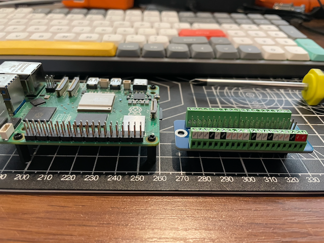

# Appendix — Recommendations for Replication of the OpenRiverCam Station Design

**Version:** 2026-08-31 (draft for internal review — not yet circulated)

**Companion to:** *Recommendations for Replication of the OpenRiverCam Station
Design*, prepared for IPB and BHLK following the meeting at Sukabumi, 21 August
2026.

**Purpose and audience.** The main report is written for a scientific but
non-specialist reader, and keeps part numbers, interface detail and procedure out
of its body. This appendix holds that material, for engineers who will build,
procure or operate the units. Each section states which part of the report it
supports. Nothing here changes a conclusion in the report; it provides the
measurements and the mechanisms behind them.

---

## A1. Camera firmware limitations in detail

*Supports report §3.3 and R9.*

### A1.1 Platform and the origin of the limitations

The ANNKE C1200 is a Hikvision OEM product: Hikvision **G6 platform** hardware
running ANNKE-branded firmware. Configuration is over **ISAPI**, Hikvision's HTTP
REST interface — digest authentication, XML payloads, `GET` to read a resource and
`PUT` to write it. Nearly every camera setting is reachable this way, which is
what makes version-controlled camera configuration possible at all.

The limitations below are **not hardware limitations**. They are places where the
ANNKE firmware exposes less of the interface than genuine Hikvision firmware does
on the same silicon, or where the behaviour sits below the firmware entirely.

### A1.2 Recorded-file retrieval is not exposed (the Profile C gap)

Four capture profiles were designed and tested. *Profile C* was intended to be the
quality ceiling: have the camera record to its own SD card at the full configured
bitrate with no real-time delivery constraint, then pull the finished file over
the Ethernet link faster than real time.

The sequence requires five ISAPI calls:

```
1. PUT  /ISAPI/ContentMgmt/record/control/manual/start/tracks/101
2.      wait N seconds
3. PUT  /ISAPI/ContentMgmt/record/control/manual/stop/tracks/101
4. POST /ISAPI/ContentMgmt/search
5. GET  /ISAPI/ContentMgmt/download?playbackURI=<uri>     <-- not exposed
```

Step 5 is the blocker. On genuine Hikvision firmware the endpoint returns the
recorded file over HTTP at wire speed. **ANNKE's firmware exposes it for still
images only**; recorded video files are not downloadable over HTTP ContentMgmt.

The implemented workaround pulls the clip by RTSP playback with codec copy
(`ffmpeg -rtsp_transport tcp -c copy`) — a remux with no re-encode, so byte
quality is preserved, but it reintroduces exactly the RTSP transport dependence
Profile C existed to avoid. Profile C was therefore not selected for production.


### A1.3 The measured cost in delivered bitrate

| Quantity | Value |
|---|---|
| ORC / pyorc recommendation at 1080p | 20 Mbps |
| Configured CBR target (baseline profile) | 16 Mbps |
| Delivered over RTSP, measured | ~15.5 Mbps |
| RTSP transport overhead | 10–20% of configured bitrate |
| Expected gain if Profile C were available | 15–25% higher effective bitrate to disk |

Profiles tested were: baseline (1080p, 16 Mbps CBR, H.264, RTSP); A (1080p,
20 Mbps CBR, RTSP); B (720p, 20 Mbps CBR, RTSP — maximum bits per pixel); C
(1080p, 20 Mbps VBR, local SD — blocked); and E (1080p, 12 Mbps CBR, H.265,
RTSP). Profiles were compared on **PIV pass rate** — the percentage of
interrogation windows passing both a cross-correlation threshold and a
signal-to-noise threshold, run through the same FFPIV engine pyorc uses — rather
than on generic image-quality proxies, because compression artefacts raise texture
metrics without producing anything that moves with the water.

### A1.4 The power-on white light (ISS-004)

The camera illuminates its white LED ring at full brightness for two to three
seconds on **every** power-on. This is a hardware self-check that runs **before the
operating system loads**, so no configuration reaches it.

Investigated and ruled out:

| Approach | Result |
|---|---|
| `supplementLightMode=irLight` via ISAPI | Setting persists; boot flash still fires |
| `whiteLightBrightness=0` via ISAPI | Setting persists; boot flash still fires |
| `/ISAPI/System/externalDevice` `enabled=false` | Endpoint not supported on this firmware |
| Disabling smart events / motion detection | Boot flash is not event-triggered |
| CGI endpoints | Removed from G5/G6 firmware |
| Telnet / SSH | Not accessible on this firmware generation |
| ONVIF auxiliary control | Maps to wired relay outputs, not LED drivers |
| Firmware update | No Hikvision firmware version offers a boot-flash disable |
| Physical masking | White and IR LEDs interleave in one ring behind a single dome — masking white also blocks IR night vision |
| Continuous camera power | 118 Wh/day → 425 Wh/day; autonomy 2.5 d → under 1 d. Not viable on the solar budget |

At Sukabumi — an urban canal with residences on both banks — a 15-minute cycle
would produce 96 flashes per day. The station runs a 30-minute cycle, 48 per day.
The issue record lists a longer cycle among the candidate mitigations; on this
camera, halving the flash rate also halves the measurement rate.

### A1.5 Boot time

| Milestone | Time |
|---|---|
| Basic boot, LED activity | ~30 s |
| Full boot, network ready | ~60 s |
| Recommended settling time | 1–2 min |
| PoE negotiation | under 1 s |

Boot draws 1–4 W above nominal, settling after roughly 30 seconds. The firmware-level
options that would reduce this — suppressing console output, LZ4 rather than gzip
for kernel and initramfs, asynchronous driver probing, removing unused modules,
zero bootloader delay — are not exposed on consumer camera firmware. Purpose-built
SoCs reach 250 ms boot, but not in this class of camera.

On a station whose normal wake is about two minutes, a 30–60 second camera boot is
a large fraction of the awake period, and the energy is spent before any video
exists. This is the single strongest technical argument for R11.

---

## A2. Replacing the camera firmware

*Supports report §3.4.*

### A2.1 What was researched, and what was not

The procedure studied was **cross-flashing genuine Hikvision firmware onto the
ANNKE-branded hardware**, which share the Hikvision G6 platform. The community
reports that the Hikvision image restores the full ISAPI surface including
`ContentMgmt/download`, which would make Profile C viable as designed.

This is **unofficial vendor firmware, not an open-source firmware stack.**
Open-source firmware projects exist for some IP camera SoCs, but none was
evaluated against this hardware and nothing in this project's record supports a
recommendation on them. The risks in A2.2 arise from the act of replacement rather
than from the licence of what is loaded, so they apply to either route.

**Status: documented as a contingency, not executed.** The gate was to attempt it
only if RTSP-live capture proved unable to deliver an acceptable PIV pass rate. It
did not, so the procedure was never run.

### A2.2 Risks

**Bricking, with an expensive recovery path.** Some ANNKE firmware revisions reject
the Hikvision `digicap.dav` installer at the web uploader. A failed flash can leave
the camera unbootable; recovery is a TFTP boot from the internal bootloader, and on
some models that requires opening the housing and wiring to the UART pads. On an
IP67 camera intended for permanent outdoor mounting, breaking the seal is itself a
reliability event.

**Hardware-revision dependence.** The community recipe applies to specific ANNKE
hardware revisions. The revision of each unit must be confirmed against the recipe
before flashing, and a later procurement batch may not match even where an earlier
one did — a poor property for a pilot buying units over time.

**No support path.** The authoritative procedure is a community forum thread that
is edited over time, not vendor documentation. It must be re-read before every
attempt and can stop being correct without notice.

**Warranty void.** Cross-flashing departs from the supported image; RMA is not
available for unrelated later hardware faults.

**Spares stop being interchangeable.** A cross-flashed camera and a
factory-firmware spare do not accept the same configuration profile. Every spare
must be flashed to match, which hands the flashing procedure — and its bricking
risk — to whoever maintains the station locally. This conflicts directly with the
design constraint that any component be replaceable in five minutes with common
tools.

**It does not fix the boot flash.** That behaviour is pre-OS; no firmware image
suppresses it. Two of the three limitations in A1 survive the flash.

### A2.3 If it is attempted anyway

Prerequisites, in order:

- An **uncommitted spare** as the test unit. Never flash an installed production
  camera first.
- Full configuration backup of the spare, pulled and committed to version control.
- The shipping ANNKE firmware image saved, for rollback.
- A Hikvision image matching the G6 platform, from the region-appropriate support
  site or a known-good community mirror.
- Hardware revision of the test unit confirmed against the recipe's supported
  revisions.
- A TFTP server prepared on a laptop for recovery, serving the recovery image at
  the bootloader's default address.
- Physical access to the camera body, and a USB-TTL adapter, for worst-case UART
  recovery.

Verification order after flashing, stopping and rolling back at any failure: web
UI login; `GET /ISAPI/System/deviceInfo` returns sensible XML; an RTSP clip pulls
normally (confirms encoder, sensor, PoE and network); then the make-or-break test,
a recorded clip retrieved over HTTP `ContentMgmt/download`; then a profile
comparison against the RTSP baseline on delivered bitrate and PIV pass rate.

---

## A3. Survey scope of work

*Supports report R2.*

Required deliverables for a contracted survey at one site:

1. **Ground control points** — 6–10 points visible from the camera view, in UTM
   Zone 48S (SRGI2013), horizontal RMSE ≤ 3 cm, vertical RMSE ≤ 7 cm, **RTK Fixed
   observations only, no Float**.
2. **River cross-section** — distance–elevation pairs bank to bank through the
   camera view, chainage from a defined datum stake, 0.5–1.0 m spacing with extra
   points at every break in slope, covering wetted and dry portions.
3. **Staff gauge datum tie** — elevation of the gauge zero in the same coordinate
   system as the control points, with at least two independent checks.
4. **Permanent benchmark** — one concrete or rebar monument per site, outside the
   flood footprint, coordinates recorded, so a future team can re-establish the
   datum if a control point is lost.
5. **Written report** — equipment model and serial number, CORS stations used,
   observation duration and fix status per point, processing software, computed
   RMSE, and field sketches of control and benchmark positions.
6. **Data files** — point list as CSV (ID, Easting, Northing, Elevation, RMSE-H,
   RMSE-V, duration, fix status), raw RINEX logs where static observation was
   used, cross-section as CSV.

**Indicative cost: Rp 5,000,000–15,000,000 per site**, one site, one day of field
work, all deliverables, including PPN. A quote materially below this indicates
equipment that is not multi-band geodetic grade.

**Acceptance checks on delivery.** Every control point meets the RMSE gate — any
that does not is re-measured or removed. The quote and report state RTK **Fixed**,
not generic "centimetre accuracy". One consistent vertical datum across control
points, cross-section and gauge zero.

**Two field conditions.** Have the staff gauge installed at its final position
*before* the survey, since the datum cannot be tied to a gauge that later moves.
And be on site during the survey — reported RMSE values are only meaningful if the
points measured are the ones the camera can actually see.

### A3.1 Why this is specified so tightly

Two RTK surveys at Sukabumi, on consecutive days with the same equipment and
methods, produced check-point spreads of approximately **99 cm horizontal and
139 cm vertical** between repeat occupations of the same physical markers,
exceeding the applicable RTK gate by roughly 30 times. Same-marker drift between
day one and day two reached 89 cm.

**IPB's total-station survey replaced the RTK approach and is what the station
runs on.** The deployed camera configuration (`Fit 6`, applied 2026-06-11) is
built from IPB data alone — GCP coordinates from the IPB spreadsheet,
cross-sections from the IPB transects, calibration frame from the May survey
video — and fits at **0.037 m RMSE** against the 5 cm target, with
`z_0 = h_ref = 615.0 m`. An interim auto-fit calibration recovered from the failed
RTK data (4.61 cm RMSE on a six-point subset, `z_0 = 617.065`) was used before
that and is now obsolete. **The two must not be mixed**: the IPB low-water surface
is about 2 m lower. See `survey_data/ipb_survey_1/handoff_station/`.

Candidate causes of the RTK noise include poor base-station coordinate quality,
sky obstruction and RF interference at the urban canal site — one of the three
reasons an open site is recommended.

---

## A4. Availability record

*Supports the report's field section.*

**Read this as a record of failure modes in this design, not as a performance
assessment of the deployment.** Sukabumi is a volunteer-supported pilot that was
never built to production standards of availability or record continuity. The
numbers below are here so that an engineer building a different design knows which
failure modes are real and worth designing against. They are not a benchmark, and
they should not be used as one.

Reconstructed from `sensor_readings` on the server: the station writes rows on
every wake, so their absence bounds when it was not running. Regenerate with
`liveorc_server/station-health/station_gaps.py --since 2026-04-01`.

Window: **2026-04-16 to 2026-08-28, 133.5 days observed. 13 interruptions.**

| Onset (WIB) | Recovered (WIB) | Duration |
|---|---|---|
| 04-17 06:23 | 04-17 11:03 | 4.7 h |
| 04-17 15:01 | 04-17 17:10 | 2.1 h |
| 04-18 11:33 | 04-18 12:26 | 0.9 h |
| 04-19 08:20 | 04-19 13:17 | 4.9 h |
| 04-19 14:09 | 04-20 08:30 | 18.3 h |
| 04-20 14:13 | 04-21 09:43 | 19.5 h |
| 05-02 06:31 | 05-02 07:31 | 1.0 h |
| 05-11 23:01 | 05-13 13:03 | 38.0 h |
| 05-16 00:47 | 05-25 07:00 | **9.3 d** |
| 06-25 04:30 | 07-02 10:38 | **7.3 d** |
| 07-02 10:43 | 07-03 09:47 | 23.1 h |
| 08-15 01:30 | 08-20 10:39 | **5.4 d** |
| 08-20 10:39 | 08-21 08:14 | 21.6 h |

Raw total 27.5 days. Roughly **2.7 days of the 05-16 interruption was a
sensor-upload failure rather than downtime** — the station was running and its
rows did not reach the server — so genuine downtime is approximately 24.8 days.
A further interruption began 2026-08-28 and was open at the date of writing.

**Duration distribution:** 9 under 24 h; 1 at 24–48 h; **0 between 2 and 5 days**;
3 at 5 days and over.


**Two caveats on the method.** Rows accumulate locally and backfill on reconnect,
so a gap that later fills was an upload failure, not downtime; the 13 above stayed
empty long after recovery. And the station's CSVs rotate at 30 days, so for gaps
older than that a backlog could have been destroyed before it could backfill.

### A4.1 Maintenance mode

`orc-maintenance-check` fetches a station mode file from a public repository on
every boot. Set to `maintenance`, it creates a flag that makes `orc-capture` skip
capture entirely and leaves the processor awake for the full scheduled ON window
— roughly **12× the energy of a normal wake**, and no data.

Seven maintenance windows totalling 549 h, 17% of the observation span:

| | Long-wake ticks | Rate |
|---|---|---|
| Inside maintenance | 870 | **1.59/h** |
| Outside | 477 | 0.18/h |

A factor of **8.8**. Nine of the 13 interruptions fall inside or immediately after
a maintenance window, including the two longest.

**The flag cannot be stuck**, by design: it lives on tmpfs and is destroyed on
every power cycle, recreated only if the remote file still reads `maintenance`,
and every failure path in the check removes it. The defect is not stickiness but
the absence of an expiry and of any alarm while it is set.

**One inference withdrawn.** An earlier analysis reported long wakes preceding
outage onsets at p = 2.7e-07 and read it causally. The association is real;
maintenance mode was generating both terms. The chain from extended runtime to
drain to interruption survives on the natural experiment above, not on that
correlation.

---

## A5. Optical water-level detection

*Supports report §4.3 and R1.*

Window 2026-07-08 to 07-14, two sets of 100 videos each (most recent by status).
Station clock is UTC, verified against the tracked capture configuration; local
WIB = UTC+7.

Every failure ends identically — a waterline is found, then rejected by the
signal-to-noise gate:

```
Found water level at h: 614.795 m with too low signal-to-noise: 1.306 < 2.000
Water level could not be estimated from video.
```

| Set | n | S/N min | median | max |
|---|---|---|---|---|
| Passed | 100 | 2.004 | 4.009 | 5.561 |
| Failed | 100 | 1.185 | 1.630 | 1.983 |

The gate defines the split, so the absence of overlap is definitional and carries
no information. What the distributions do show is how far each population sits
from the threshold. **Failures are not marginal:** median 1.63, and only 23 of the
100 reach 1.8, so dropping the gate to 1.8 would recover under a quarter of them
while admitting water levels the detector had no confidence in. **Do not lower it.**

The converse deserves equal weight and cuts the other way: **36 of the 100 passing
captures fall between 2.0 and 3.0**, and 26 fall below 2.5. A substantial share of
accepted water levels sit close to the threshold, which is an argument for the
independent reference in R1 rather than for adjusting the gate. Figure 2 of the
main report plots both distributions.

**The failures find the right waterline.** Detected `h` is identical across both
sets (median 614.794 m against a 614.3–618.5 m search band), and only 15 of 100
failures pin near the band floor. So the search band is correct and the river was
stable all week; the detection simply lacks confidence.

**Hour-of-day distribution (WIB):**

```
00–05   fail 0   pass 36      12      fail  8   pass 1
06      fail 3   pass  3      13      fail  4   pass 3   <- solar noon
07      fail 4   pass  4      14      fail  3   pass 4
08      fail 9   pass  0      15      fail 10   pass 2
09      fail 11  pass  0      16      fail 12   pass 1
10      fail 11  pass  1      17      fail 11   pass 2
11      fail 9   pass  3      18      fail  5   pass 4
                              19–23   fail  0   pass 44
```

Zero failures at night. All failures inside the daylight window, with **two peaks
(08–12 and 15–17) and a dip at solar noon**.

**Interpretation.** The daylight bound implicates direct sunlight; the twin peaks
with a midday dip are the geometric signature of **specular glint** — a mirror
reflection off the water surface into the camera — because veiling glare tracks
sky brightness rather than sun angle and would not produce the midday dip.
Alternatives considered and argued against: threshold too strict (bimodality);
wrong search band (identical `h` in both sets); general daytime dimness (would be
monotonic from dawn, not twin-peaked); afternoon wind ripple (explains 15–17, not
08–12); weather or turbidity (would not respect the daylight boundary).

**This remains a hypothesis.** Direct visual confirmation — measuring the
saturated-pixel fraction in the water band on matched failing and passing frames —
is pending. R1 does not depend on it: the failure is measured either way, and
water-level estimation aborts the whole processing run, so each daytime failure
costs the entire discharge measurement.

**Sampling caveat.** Each set is the 100 most recent of its status, so the passing
set reaches back only to 07-11. A naïve per-day ratio for 07-08 to 07-10 is a
sampling artefact. The day/night and S/N results are unaffected.

---

## A6. Data delivery

*Supports report §4.4 and R7.*

Measured on the station 2026-08-27, ORC-OS video table, 2026-04-08 to 2026-08-27:

| | Count | Share |
|---|---|---|
| Total rows | 5,406 | |
| Processing: DONE | 2,957 | |
| Processing: ERROR | 2,324 | **43% failed** |
| Processing: NEW | 125 | |
| Sync: SYNCED | 2,536 | |
| Sync: FAILED | 2,744 | **51% never reached the server** |
| Sync: LOCAL | 126 | |

Disk state at the same time: 51 GB used of 58 GB, **5.1 GB free against a 5.0 GB
purge threshold** — pinned to the line rather than merely full. The disk manager
checks every 300 s, purges just enough to clear the minimum, and is back under it
by the next check. Files on disk reached back only to 06-07 while table rows
reached to 04-08; roughly 2,190 rows had no file behind them.

A separate **12-day gap in the video record (2026-07-30 to 08-11)** occurred while
sensor data flowed normally at 48 rows/day throughout. It is very likely
server-side.

**The lost video itself does not matter** — Sukabumi is a technology pilot
contributing to no operational product, so this is not a data-rescue exercise. The
finding is the 51% sync failure rate as a verdict on the design, which would be
disqualifying in a deployment anyone relied on.

---

## A7. Power, scheduling and the always-on comparison

*Supports report R6, R10 and R11.*

### A7.1 Corrected power budget

| | Original estimate | Corrected |
|---|---|---|
| Daily consumption | ~94 Wh/day | **~118 Wh/day** |
| Battery autonomy, no sun | 3.2 days | **2.5 days** |

The 25% shortfall was the quiescent draw of two DC/DC converters (~0.5 W each,
continuous) and the rain gauge (~150 µA, continuous) — always-on loads wired
directly to the battery bus that draw whether the Pi is awake or not. Solar margin
remains adequate for normal operation; the consequence is that extended cloud
exhausts the battery about 17 hours sooner than planned, which matters for setting
alert thresholds and maintenance windows.

### A7.2 Scheduling: Witty Pi against the Pi 5 native RTC

| | Witty Pi 5 HAT+ | Pi 5 native RTC |
|---|---|---|
| Cost | ~USD 46–50 + CR2032 | Included; ML-2020 cell ~USD 5 |
| Boards in stack | One extra | None |
| GPIO consumed | None (I²C only) | None |
| Power to Pi when off | **Cut entirely** | Standby draw remains |
| Input range | **6–30 V direct from battery bus** | Requires regulated 5 V |
| Low-voltage cut-off | **Yes, configurable** | No |
| Temperature cut-off | **Yes** | No |
| Dual input with failover | **Yes** | No |
| Re-arming the next wake | Separate scheduler; **can be left stale** | Written by the OS at shutdown |

The native RTC was the original design for both stations. The Witty Pi was
reinstated late in the build for one reason: **the Pi 5's ML-2020 RTC battery
connector, a small JST-SH part, failed on both boards.** Treat that connector as
handling-sensitive, provide strain relief on the battery lead, and hold a
scheduling board in spares.

The right split is by power source. On **mains power or indoor compute**, the
native RTC is preferable — the Witty Pi's protections are not needed and the
re-arm becomes part of the normal shutdown path. On a **solar, battery-backed
field station**, keep the Witty Pi: its low-voltage and temperature cut-offs and
its wide-input conversion are doing real work against exactly the deep-discharge
failure mode this deployment has been chasing.

<figure class="photo photo-wide">

<figcaption>The compute board and the GPIO screw-terminal riser it stacks onto.
Every signal leaves as a screw terminal, which is what lets a non-specialist
rewire the station with a screwdriver — and what makes the scheduling board a
swap rather than a rebuild. This is the assembly R8 would move indoors and R10
would simplify; Figure 3 of the main report compares the two arrangements.</figcaption>
</figure>

### A7.3 Duty-cycled against always-on

| | Solar, duty-cycled | Mains, always-on |
|---|---|---|
| Materials cost | USD 1,340, excluding the solar array | ~USD 1,333 (`BOM_Jakarta.md` project total) |
| Solar array | Panel, controller and battery — already on site at Sukabumi, so **not in the figure above**; a new solar site must add one | **None needed** |
| Achievable time step | 30 min | Down to continuous |
| Camera boot paid per measurement | 30–60 s | **None after installation** |
| White-light flash | 48 per day | **Once, at installation** |
| Camera power | Cycled; 118 Wh/day system total | 425 Wh/day equivalent, irrelevant on mains |
| Missed-wake latch | **Present** | No schedule to miss |
| Remote diagnostic window | Tens of seconds per cycle | Continuous |
| Siting constraint | Anywhere with sun | **Within reach of reliable mains** |

**On cost, be careful with the comparison.** The two builds come to roughly the
same materials total, and an earlier draft of this appendix claimed the mains
configuration was cheaper at USD 1,030. That figure was not sourced from either
bill of materials and is withdrawn. What the BOMs support: `BOM_Sukabumi.md`
totals USD 1,340.19 for electronics and enclosure, and Sukabumi already had its
200 W panel and 50 Ah battery on site, so no array is included; `BOM_Jakarta.md`
shows a project total of about USD 1,333 with USD 1,076.88 actually ordered for a
one-camera configuration. The real difference is that a **new** solar site has to
buy an array and a mains site does not.

The always-on configuration removes five distinct failure modes. Its cost is
siting: it must be within reach of reliable mains power, which constrains where
the station can go and may conflict with the preferred measurement section. Where
mains is present but unreliable, add a UPS sized to the observed outage duration
and treat the station as always-on with brief interruptions rather than as
duty-cycled.

---

## A8. Source documents

| Topic | Path |
|---|---|
| Bill of materials, Sukabumi | `spring_2026_ID/BOM_Sukabumi.md` |
| Bill of materials, verified reference | `rc-box/BOM_VERIFIED.md` |
| Design specification | `rc-box/DESIGN_SPECS.md` |
| Split camera/compute architecture | `spring_2026_ID/docs/SPLIT_ARCHITECTURE_DESIGN.md` |
| Camera ISAPI configuration management | `spring_2026_ID/research/camera_isapi_config_management.md` |
| Cross-flash contingency research | `spring_2026_ID/research/annke_hikvision_crossflash_research.md` |
| Camera profile test procedure | `spring_2026_ID/docs/CAMERA_PROFILE_TEST.md` |
| Camera boot-time research | `rc-box/research/ip_camera_boot_times.md` |
| 12MP IP67 camera survey | `rc-box/research/ip_cameras_12mp_ip67.md` |
| Witty Pi 5 research | `spring_2026_ID/research/witty_pi_5_research.md` |
| Survey scope of work | `survey/outsourced_survey_brief.md` |
| Survey error analysis | `survey/research/professional_surveyor_and_escape_hatch.md` |
| Optical water-level finding and dataset | `spring_2026_ID/findings/optical_wl_daytime_glint.md` |
| Field issue log | `spring_2026_ID/ISSUE_LOG.md` |
| Availability analysis tool | `spring_2026_ID/liveorc_server/station-health/station_gaps.py` |
| Indonesian hydrometric standards | `spring_2026_ID/research/indonesia_hydrometric_standards.md` |
| Lessons learned | `spring_2026_ID/LESSONS_LEARNED.md` |
